# はじめに
本記事では Unicode のエンコーディング方法について説明しています。最初に文字コード周辺の概念を整理した後、具体的なエンコーディング方法の説明を行なっています。



# 概念の整理
文字コードとその周辺の知識を理解する為には「符号化文字集合」「文字符号化方式」などの概念を最初に理解しておかないと混乱する事になります。
そこで、まずは、「アルファベット」「ひらがな」「カタカナ」などの文字集合が、計算機上の表現やネットワーク伝送形式として利用される為に、次の四段階のレベルがあることを理解します。

<div style="text-align: center">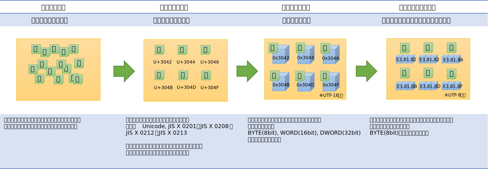</div>

## 抽象文字集合（ＡＣＲ）
- 単純な文字の集合

「抽象文字集合」あるいは単に「文字集合（文字セット）」は、その名の通り、文字の集合を指します。とくに難しい概念ではありません。「アルファベット」も「５０音」も文字集合の一種です。
後述の符号化文字集合と違うところは、文字に番号が割り当てられていない点です。

## 符号化文字集合（ＣＣＳ）

- ひとつひとつの文字を区別できるようにする為に、文字にユニークな番号を採番した文字集合

前述の抽象文字集合はあくまで文字の「集まり」を指しているだけです。
計算機で文字を扱うには、文字を区別する為に、文字にユニークな番号が採番されていないと不便です。
ちょうど学校のクラスで生徒に出席番号を振るのと同じように、一つ一つの文字にもユニークな番号を採番します。
各文字にユニークな番号を採番した文字集合のことを符号化文字集合といいます。
日本語の場合、JIS X 0201、JIS X 0208、JIS X 0212、JIS X 0213と呼ばれている規格が符号化文字集合です。
Unicode では 0x0 - 0x10FFFF (16進数) の範囲に文字が採番されています。

なお、採番した番号の事を「コードポイント」あるいは「句点位置」と呼びます。

## 文字符号化形式（ＣＥＦ）
- 文字列を計算機のメモリ上で扱いやすい形式に変換する符号化方式

符号化文字集合として、Unicode 文字は 0x0-0x10FFFF の範囲に採番されていて 21bit の範囲で表現されます。
しかし、計算機は 21bit というデータサイズをそのまま扱うのは苦手です。計算機が得意なのは、通常、BYTE(8bit)、WORD(16bit)、DWORD(32bit) などの 8 の倍数のデータ型です。
つまり文字列を計算機で扱う為には、8bit/16bit/32bitの箱の配列に変換する必要があります。
この変換作業のことを「エンコード」あるいは「符号化」と呼びます。

文字符号化形式は、このエンコードのルールを規定したもので、UTF-8, UTF-16, UTF-32 と呼ばれている規格があります。

## 文字符号化スキーム（ＣＥＳ）
- 文字列をファイルに保存したりネットワークに流したりする形式に変換する符号化方式

文字列をファイルに保存したり、ネットワークに伝送したりする場合は、計算機のメモリ上で扱うのとは別の符号化のルールが必要です。
なぜなら、ファイルに保存したりネットワークに伝送する場合には、16bit や 32bitの配列はそのまま保存できませんので、8bit の配列（直列化=シリアライズ）にする必要があるからです。
文字符号化スキームは、ファイルに保存したりネットワークの伝送に使用することを目的に、8bit の配列に直列化する為のルールです。
UTF-8, UTF-16LE, UTF-16BE, UTF-32LE, UTF-32BE と呼ばれている規格があります。

## コードポイント
- 文字に採番された番号

符号化文字集合では、一つ一つの文字には出席番号みたいに番号を持ちます。
この番号のことをコードポイント（符号位置・区点位置）と呼びます。Unicode では、0x0 - 0x10FFFF (16進数)の範囲で採番されています。また JIS X 0208 では 94 個の「区」と 94 個の「点」で定義されています。
ここで「コードポイント」はあくまで机上で採番した単なる出席番号であって、計算機のメモリ上のデータ値とは異なりますので注意してください。

## 文字コード
- 文字のメモリ上のデータ表現、あるいは文字符号化の体系

文字コードという用語は使われる場面によって幾つかの意味があります。符号化文字集合や文字符号化方式をまとめた規則体系を表わして「文字コード」と呼ぶ場合もありますし、
文脈によっては計算機のメモリ上で表現されているデータの値を指して文字コードと呼びます。

(例1) そのファイルの文字コードは？ (体系を聞いている)<br/>
(例2)「あ」の文字コードは SJIS でいくつ？ (データ値を聞いている)<br/>

## エンコード（符号化）
- 文字を変換する事

「エンコード」あるいは「符号化」とは、データを一定のルールに基づいて変換することを指します。
符号化文字集合の各文字を文字符号化形式や文字符号化スキームのルールに基づいて変換することをエンコード（符号化）と呼びます。
また「エンコードする」と「符号化する」は同じ意味で使われます。

## エンコーディング
- 文字を符号化する時の規格

「エンコーディング」は、符号化の規格(方式)を意味します。JIS, Shift-JIS, EUC, UTF-8, UTF-16, UTF-32 などはエンコーディングの規格です。


# Unicode
Unicode は符号化文字集合や文字符号化方式などを定めた業界規格です。
Unicode は符号化文字集合の規格でもあり、符号化方式（CEF, CES）の規格でもあります。 
世界中の文字を単一の文字集合（文字セット）として扱っているいるところが特徴です。

## コードポイントの構造
最初に Unicode のコードポイントの構造を簡単に押さえておくと、次章以降のエンコーディングの話が理解しやすくなりますので少し触れておきます。
Unicodeのコードポイントは 21bit で表現されます。具体的な範囲は 0x0 - 0x10FFFF になります。
また、各ビットは、次の図のように「面」「区」「点」に分解されます。 

<div style="text-align: center">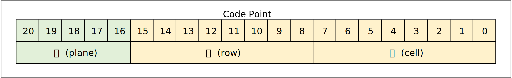</div>
※念の為に補足しますが、これは「コードポイント」であり、計算機上のデータ値ではありません。

## コードポイントの範囲と文字種
Unicodeでは各面ごとに、登録されている文字種がおおむね決まっています。

その中で、第０面のことを基本多言語面（BMP）といい、基本的な文字のほとんどが第０面に収まっています。
第０面は 16bit で表現できる範囲であり、ほとんどの文字は16bitで表現可能です。
しかし、その後、基本多言語面だけでは文字の数が不足することが分かり、
後からさらに 16 面が追加されました(0x01 - 0x10)。16面を表現するのに、Unicode に 5bit が追加され、Unicodeのコードポイントは、21bit に拡張されました。

以下に各面にどんな文字種が収められているのかを簡単に表にしています（出展：Wikipedia）

<div style="text-align: center">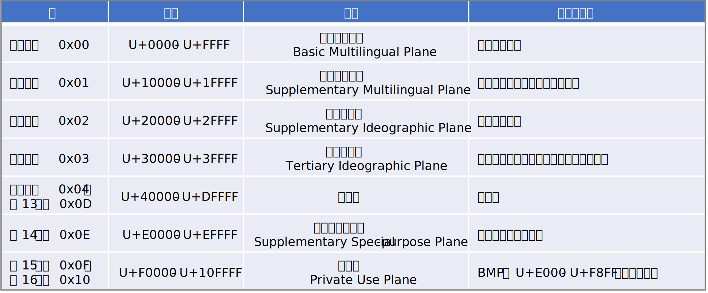</div>

## 文字符号化形式
 - 文字符号化形式とは、つまり文字
 をメモリ上に表現する為の形式の事です。

ここでは、具体的に Unicode を計算機上（メモリ上）のデータ型にエンコードする方法についてみていきます。ここでは "こんにちは" という文字列をエンコードしてみます。
最初に "こんにちは" のコードポイントを示しておきます

<div style="text-align: center">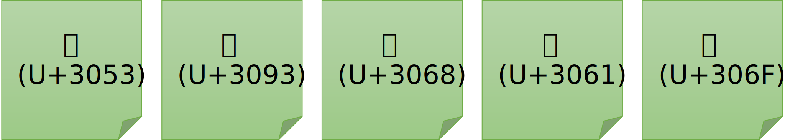</div>
※ U+XXXX (Xの部分は16進の数字）という表現は Unicode のコードポイントを表す

### UTF-32
Unicode（のコードポイント）を DWORD(32bit) の箱にエンコードする方式です。
C/C++ の型で言えば long (32bit) 型の配列で Unicode 文字列を表現する方法ですね。
32bit は 21bit の Unicode を格納するのに十分な大きさですから、特に難しい変換は行いません。
コードポイントの数字がそのまま DWORD の箱に収まります。

<div style="text-align: center">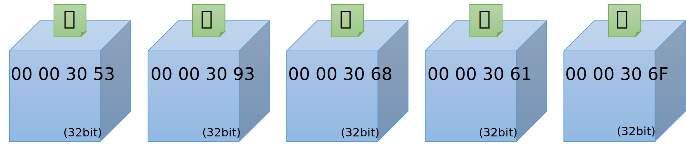</div>
※ 数字は16進数です

UTF-32 は Unicode の文字をすべて表現できる範囲をもつので、一番、シンプルなエンコード方式といえます。
しかし問題もあります。
それはたった一文字を表現するのに 32bit (4バイト) も使う必要があるからです。
特に英語圏の人々からみれば、自分たちが使う字は 8bit もあれば十分なのに 32bit も使用するなんて過剰に思えるでしょう。
そこで UTF-32 以外にもいくつかのエンコード方式が用意されています。

### UTF-16
Unicode （のコードポイント）を WORD(16bit) の箱にエンコードする方式です。
C/C++ の型で言えば short (16bit) 型の配列で Uncode 文字列を表現する方法です。先ほどと同じようにエンコードしてみます。

<div style="text-align: center">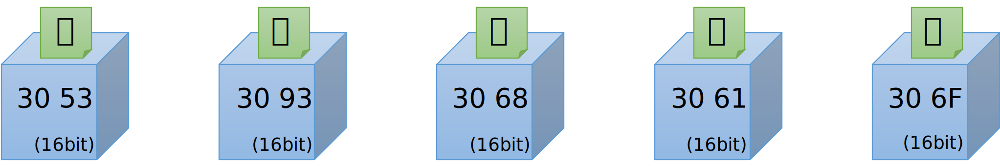</div>
※ 数字は16進数です

箱の大きさが WORD(16bit) サイズになっただけで、UTF-32 と変わらないですね。
実は、日本語で扱う文字はそのほとんどが 16bit で表現できる範囲に収まっています。
なので多くの場合は変換に特別なルールは必要ありません。
ただし Unicode は 21bit (0x0 - 0x10FFFF) の範囲で定義されていますから、中には WORD (16bit) の箱に収まらない文字が存在します。
絵文字や、一部の外国の文字、あるいは一部の漢字です。
UTF-16 には、それらの文字をエンコードするための特別なルールが用意されています。
それが次に説明するサロゲートペアです。

#### サロゲートペア
サロゲートペアによって、コードポイント値が 16bit に収まらない範囲にある Unicode 文字を UTF-16 で表現することができます。
「ペア」という言葉からわかるように、二つの箱で一文字を表現します。
なお、サロゲートペアのうち先行する箱をハイサロゲート、後続する箱をローサロゲートとよびます。
具体的にサロゲートペアで表現される文字の例をいくつかみてみます。

<div style="text-align: center">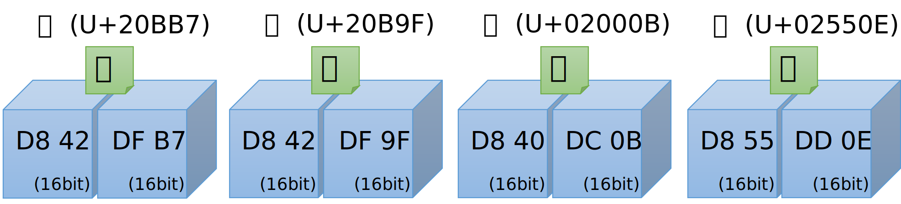</div>

#### サロゲートペアのエンコード方法
サロゲートペアの領域にあたる文字は、具体的には U+10000 ～ U+10FFFF の範囲にコードポイントを持つ文字です。
つまり第1面から第16面ですね。これらのコードポイントを、UTF-16 の箱２つで表現できるようにエンコードする必要があります。
この変換は次のルールで行います。

《 変換概要 》<br/>
U+10000 ～ U+10FFFF の範囲にあるコードポイントを重複の無い 16bit の箱２つに変換する。

《 STEP1 》<br/>
まずコードポイントを第10bitの位置で２分割します。
コードポイントは、全体で 21bit で奇数なので、丁度半分にはできないので、とりあえず上位11bitと下位10bitに分解します。

<div style="text-align: center">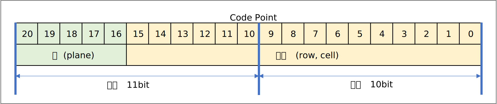</div>
<br/>

《 STEP2 》<br/>
ここで上位 11bit を 10bit に圧縮する方法を考えます。<br/>
後述するように、上位ビットと下位ビットをサロゲートコードポイント(後述)の範囲に収める為に、それぞれ 10bit にする必要があります。
下位ビットはすでに 10bit ですが、上位ビットは 11bit です。上位 11bit を詳しくみると、面を表す 5bit と区点を表す 6bit に分かれます。
ここで、10bit に収める為に、面を 4bit で表現できないか考えます。

面(plane)は第0面から第16面あるので全部で17面あります。この為、面をすべて表現するには、最低限 5bit 必要です。
しかし、第０面はサロゲートペアにする必要がないので、サロゲートペアに変換する必要がある面は、第1面から第16面だけです。
つまり全部で16面を表現できればよく、4bit で表現可能です。
そこで面(plane) の範囲を 0x00xxxx - 0x0Fxxxx に収まるようにする為に、コードポイント値から 0x10000 を引きます。
結果、面(plane)が 4bit の範囲に収まることとなり、上位も下位も 10bit で揃います。

<div style="text-align: center">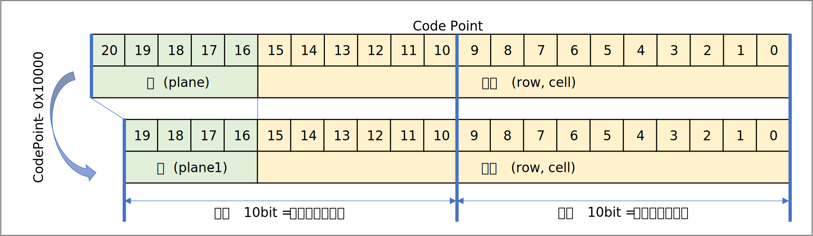</div>
<br/>

《 STEP3 》<br/>
最後に、ハイサロゲート、および、ローサロゲートを、それぞれ以下の範囲に収まるように調整(シフト)します。
 
  - ハイサロゲート ( 0xD800～0xDBFF )
  - ローサロゲート ( 0xDC00～0xDFFF )

具体的な方法は次の疑似コードを確認してください。なお、0xD800 ～ 0xDBFF の範囲のコードポイントを「サロゲートコードポイント」と呼びます（後述）

#### サロゲートペアのエンコードの疑似コード

《 エンコード方法 》<br/>
上述のルールを整理して、エンコードを C/C++ の疑似コードで表すと以下のようになります。

``` c
// 変換対象のコードポイント
int codePoint = 0xXXXXXX
// ハイサロゲートを求める
int hi = ((codePoint - 0x10000) >> 10) + 0xD800;
// ローサロゲートを求める
int lo = (codePoint & 0x3FF) + 0xDC00
```

《 デコード方法 》<br/>
上述のルールを整理して、デコードを C/C++ の疑似コードで表すと以下のようになります。

``` c
int codePoint =  (((hi - 0xD800) << 10) + 0x10000) | (lo - 0xDC00);
```

#### サロゲートコードポイント（代用符号位置）
Unicode コードポイントのうち、U+0000 ～ U+FFFF の範囲には、よく使用する基本的な文字や記号が収録されていて、この範囲のことを第０面（基本多言語面）と呼びます。第０面には、いわゆるASCII文字やひらがな、カタカナ、日本でよく使う漢字などの文字が割当てられておりますが、一部、文字ではなく、特殊な用途向けに割り当てられている範囲があり、その一つが、サロゲートコードポイントと呼ばれます。

サロゲートペアの、ハイサロゲートとローサロゲートは、0xD800 ～ 0xDFFFの範囲にありますが、まさにこの範囲がサロゲートコードポイントになります。
この範囲のコードポイントには他の文字が登録されていません。これは、その文字がサロゲートペアか否かの判断が容易になるメリットがあります。 UTF-16 の文字の配列をプログラムから扱っている時に、もしサロゲートコードポイントの範囲の値を見つけたら（前後の文字を調べる必要なく）それは二箱で一文字であると即座に見分けることができます。

### UTF-8
Unicode （のコードポイント）を BYTE(8bit) の箱にエンコードする方式です。
C/C++ の型で言えば char (8bit) 型の配列で Uncode 文字列を表現する方法です。
先程と同じように "こんにちは" という文字列をエンコードしてみます。

<div style="text-align: center">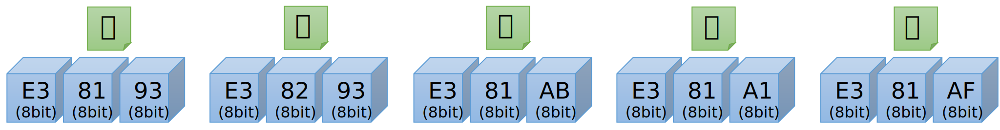</div>

数字は16進数です。なお、この例では、どの文字も３バイトに変換されていますが、すべての日本語文字が３バイトになるわけではありません。以下に説明するように、文字によってバイト数が変わるのも UTF-8 の特徴です。

#### UTF-8 の変換方法
変換ルールは以下のようになります。

 - ルール１：0x00-0x7f の範囲にある文字(ASCII)は変換なし。なお、かならず先頭ビットは 0 になる。
 - ルール２：0x80 以降の範囲にある文字は、２バイトから４バイトに変換する
 - ルール３：マルチバイト文字の第１バイト目は、その文字のバイト数を表す表現を含む。具体的には、１バイト目を２進数で表記したときに、先頭からの 1 の個数でその文字のバイト数を表す。
 
   | 110x xxxx の場合は２バイト文字 | 
   | 1110 xxxx の場合は３バイト文字 |
   | 1111 0xxx の場合は４バイト文字 |

 - ルール４：マルチバイト文字の 2 バイト目以降のバイトは、必ず 10 から始まる
 - ルール５：残りの有効ビット(表の x で表されるビット)で、コードポイントを格納する。コードポイントのビットパターンをそのまま左詰めで格納する
 - ルール６：符号化は最少のバイト数で表現しなければならない。この為、バイト数ごとにコードポイントの範囲（最小値）が定められている。つまり、理論的には １ バイトの ASCII 文字を無理やり 4バイトに変換することも可能だが、これは禁止されているという意味。

以上を表にまとめると以下のようになります。


<div style="text-align: center">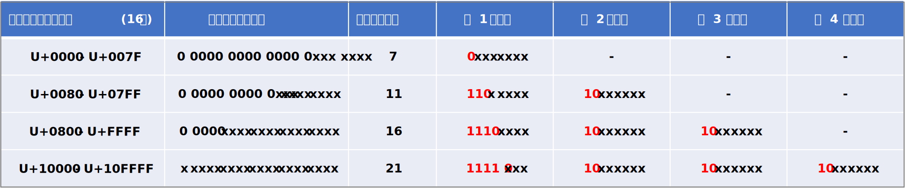</div>

#### ５バイトを超える表現

UTF-8 のエンコードの仕組み上は、５バイト (1111 1xxx) や６バイト (1111 11xx) で文字を表現する形式も原理上は可能ですが、Unicode のコードポイントは 21bit と定められていますので４バイトあれば必要十分です。よって５バイト以上のパターンで表現する事はしません。
過去には Unicode に含まれない文字を表現するのに使用されていたようですが、現在では不正とみなされるそうです。

また、７バイト (1111 111xx), ８バイト (1111 1111x) は BOM マーク（後述）として利用することが規定されていいます（つまり、予約されている）。
この為、７バイトや８バイトを表現する方法はありません。

#### サロゲートペアと各エンコーディング間の変換

サロゲートペアは UTF-16 にエンコードする場合にのみ必要な概念です。
UTF-32 と UTF-8 の場合はサロゲートペアの考え方はありません。
UTF-32 は一つの箱で一文字を表すことができるのでそもそもペアにする必要がなく、また、UTF-8 はその仕組み上、もともと複数の箱で一文字を表す仕組みなので、16bit を超える範囲のコードポイントも、他の文字と全く同じルールでエンコードすることができます。

《 サロゲートペアからの直接変換は行なわない 》<br/>
ここで、一つ注意があります。UTF-16 から UTF-8 や UTF-32 へ変換する場合は、UTF-16 のコードから直接変換しません。一度、コードポイントに戻してから変換する必要があります。
サロゲートペア以外の文字についてはコードポイントに戻さなくても結果は同じになるので結果的には問題が無いのですが、サロゲートペアについては、一度コードポイントに戻してから変換しないと違う値になってしまいます。
なお、サロゲートペアから直接 UTF-16, UTF-8 の並びに変換したものは不正なデータであるとみなされます。

## 文字符号化スキーム
 - 文字符号化スキームとは、文字列をファイルに保存する時や、ネットワークを伝送させる時のデータ表現の事です

前章で記載の文字符号化形式は、計算機のメモリ上の表現に Unicode のコードポイントをエンコードするルールですが、計算機のメモリ上のレイアウト詳細がどうなっているかは気にしていません。
具体的にいうと、計算機のメモリは CPU の種類によってビッグエンディアンとリトルエンディアンという違いがありますが、これらの違い、つまりメモリの構造はプログラムからは通常は意識する必要がないので規格上も定義されていません。
しかし、この構造を意識しなければならない状況があります。ファイルに文字列を格納する場合やネットワークに文字列を流す場合には、そもそも WORD(16bit) や DWORD(32bit)の配列ではなく、必ず BYTE(8bit) の配列にする必要があります。
そこで BYTE(8bit) の配列にエンコードする仕様として、次に記載するエンコーディングが定義されています。

### UTF-32LE, UTF-32BE, (UTF-32)
前述した UTF-32 のルールに従ってコードポイントを変換したあと、UTF-32LE はリトルエンディアン形式で、UTF-32BE はビックエンディアン形式で並べる（直列化する）だけです。
具体例は以下のようになります。また LE や BE がつけずに、UTF-32 と表記する場合もありますが、これは、単に明示していないだけで、実際には必ずリトルエンディアンかビッグエンディアンのいずれかになります。
プログラムからは後述する BOM で並びを判断します。

#### UTF-32BE

<div style="text-align: center">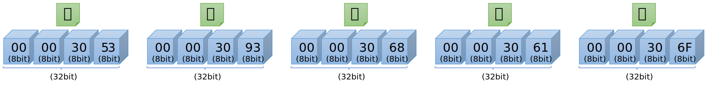</div>

#### UTF-32LE

<div style="text-align: center">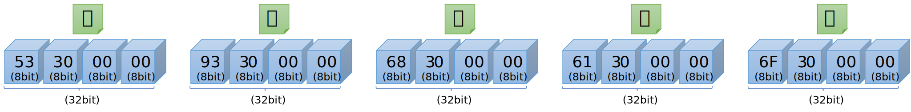</div>
※ 数字は16進数です

### UTF-16LE, UTF-16BE, (UTF16)

前述した UTF-16 のルールに従ってコードポイントを変換したあと、UTF-16LE はリトルエンディアン形式で、UTF-16BE はビックエンディアン形式で並べる（直列化）だけです。
具体例は以下のようになります。
また LE や BE をつけずに、UTF-16 と表記する場合もありますが、これは、単に明示していないだけで、中身はリトルエンディアンかビッグエンディアンのいずれかになります。
プログラムからは後述する BOM で並びを判断します。

#### UTF-16BE

<div style="text-align: center">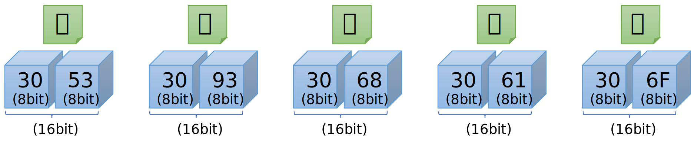</div>

#### UTF-16LE

<div style="text-align: center">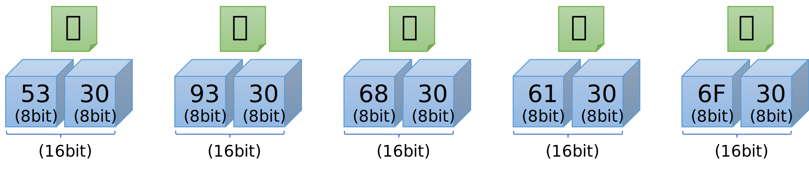</div>
※ 数字は16進数です

### UTF-8
UTF-8 は 元々 8 Byte の並びなので特に変換する事なくそのままBYTEの配列にエンコードするだけです。
この為、概念上は UTF-8 も文字符号化形式と文字符号化スキームを区別しますが、両者の実態は全く同じものになります。
変換方法については自明なので説明は省略します。

### バイトオーダーマーク(BOM)
バイトオーダーマークとは、文字符号化スキームでエンコードした文字列をバイト単位で処理するときに、
その文字列がビッグエンディアンの並びなのかリトルエンディアンの並びなのかを判別するために用いられる2～4バイトのバイト列です。バイトの並びだけではなく文字符号化方式の判定にも利用されます。

 | 文字符号化方式 | エンディアン | BOM         | 備考                                |
 |----------------|--------------|-------------|-------------------------------------|
 | UTF-8          | N/A          | EF BB BF    | U+EFEE を UTF-8 で表現した 3 バイト |
 | UTF-16 (BE)    | BIG          | FE FF       | 2 バイト                            |
 | UTF-16 (LE)    | LITTLE       | FF FE       | 2 バイト                            |
 | UTF-32 (BE)    | BIG          | 00 00 FE FF | 4 バイト                            |
 | UTF-32 (LE)    | LITTLE       | FF FE 00 00 | 4 バイト                            |

BOM は、通常はファイルの先頭等に置かれ、プログラムがエンコーディングを判断する為に使用されます。
ただし、別のプロパティ等で明示的にエンディアンまで指定できる場合（例：charset=UTF-16LE）には、
プログラムはエンコーディングを推測する必要がないので BOM を使用する必要はありません。

## その他の話題
この記事で触れられていない Unicode 回りのその他のキーワードについて、興味のある方は調べてください
 - Glapheme Cluster - 複数のコードポイントで構成されるけど、人にとっては一文字 
 - SVS (Standardized Variation Sequence/Selector) / IVS (Ideographic Variation Sequence/Selector) - 同じ文字だけど字形が違うパターンの表現
 - Bi-Directional Text - 左から右へ書く
 
 


