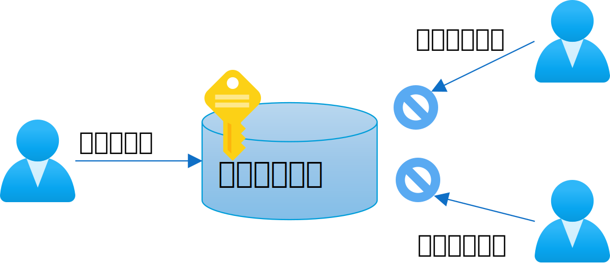
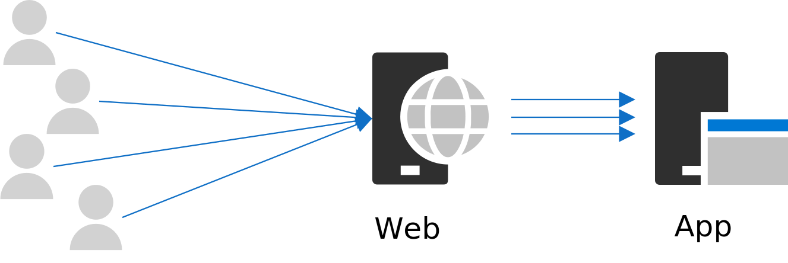
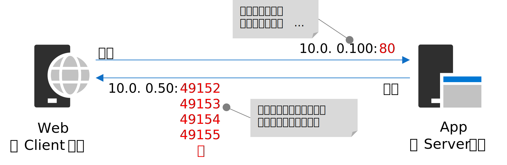
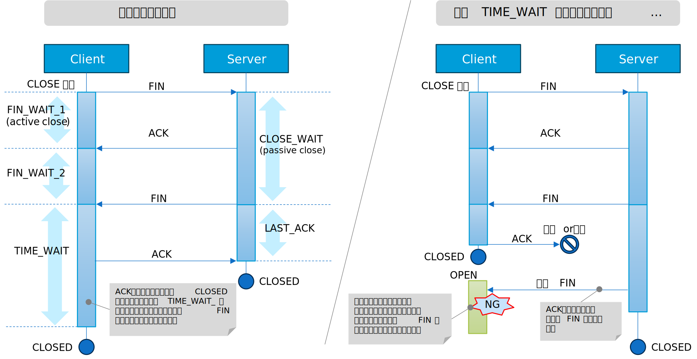
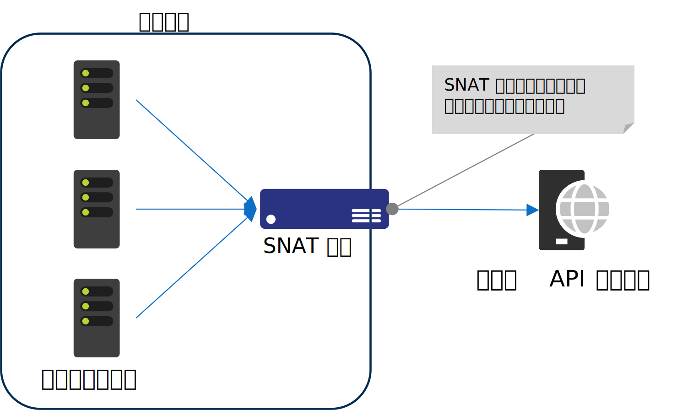

# はじめに

この記事では、サーバー環境における共有リソースの生成と破棄について注意点を説明しています。
同時に、主にプログラマ向けに、以下の二つの疑問のヒントを提供しています。

 - C# (.NET) でプログラミングする時に使う Dispose メソッドってなに GC じゃだめなの？
 - C# (.NET) の HttpClient の様に、Disposable なのに不用意に Dispose できないのは何故？

なお、C# (.NET) を例にあげていますが、言語や OS 関係なく全く同じ議論が成立しますので、普段他の言語を利用している方にも参考になると思います。



# サーバー環境における共有リソース

「共有リソース」とはメモリやネットワーク接続、ファイルディスクリプタなどの OS や PC のリソース（資源）を指します。
クライアント PC の場合は、一人のユーザーが PC のリソースを占有していますので、リソース回りの問題に直面することは比較的少ないかもしれません。
しかし、サーバー環境におけるアプリは、クライアント環境のそれとは違う設計やプログラミングを意識する必要があります。

## リソースの即時解放の必要性


Web アプリなど、サーバー環境のアプリは、一つの PC のリソースを複数のスレッド（＝ユーザーからのリクエスト）で共有しています。
あるスレッドが共有リソースを掴んだままでいると、他のスレッドが使えないという状態が発生しやすい環境です。

例えば、ユーザー A のリクエストがファイルに書き込みを行っている間に、別のユーザーの B のリクエストが同じファイルの書き込みを行うには、
当然ながらユーザー A がファイルリソースを解放するまで待たなければなりません。同じようユーザー C, D , E... がファイルの書き込みを
行おうとすると、待ち行列が発生して、ボトルネックが発生しやすい状況になるのは想像に難しくないかと思います。

<br/>
<div style="text-align: center"></div>
<br/>

この為、サーバーアプリが共有リソースを扱うときは、少しでもこの待ち行列をの影響を軽減する為に、
リソースが必要になる**直前まで取得を控え**、リソースの利用を終えたら**即時に解放**して他のスレッドが再利用できるようにする。つまりリソースを掴んでいる時間を極力短時間にする事がとても重要になります。


## GC と Dispose

C# や Java をはじめ、Garbage Collection (以降 GC) の機能を備えたプログラミング言語は、
プログラマが自分でオブジェクトの解放（＝オブジェクトに紐づいているリソースの解放）しなくて済み、メモリリーク等のバグの発生を低減させてくれる素晴しい機能です。

しかし、GC は、いつかはリソースの解放をしてくれますが、そのタイミングは GC のアルゴリズム次第で自分で制御できません。
サーバーアプリケーションの場合は、複数のスレッドがリソースを共有していますので、利用が済んだら即時にリソースを解放して、他のスレッドが利用できるようにするのがとても重要になります。
しかし、GC に頼ると、いつ解放してくれるのか分からないです。

多くの Disposable なオブジェクト (＝ C# 等で IDisposable インターフェースを実装するオブジェクト) は、OS や PC の共有リソースを扱うオブジェクトです。
前述のとおり、GC はいつかはリソースの解放を行なってくれますが、Disposable なオブジェクトは、いつかではなく、即時に解放が必要なオブジェクトです。
利用が終ったら、ユーザーが明示的に Dipspose メソッドを呼び出して、リソースの即時解放をプログラムから制御できるようにしています。

C# の場合は using を使用すると、スコープを抜けるときに自動的に Dispose を呼びだしてくれますので、以下の様に実装するのが定番です。

``` csharp
static void Main()
{
    using (StreamReader streamReader = new("foo.txt"))
    {

            // ....ファイル読み出し処理....

    } // using 句を抜けるタイミングで Dispose が呼びだされる
}
```

なお、クライアント環境でも、なるべく速やかに Dispose を使用してリソースの解放を行うのが基本ですが、サーバー環境ほどシビアではありません。
サーバーのそれに比べて using 句の範囲に融通が利きますので、サーバーとクライアントのコーディングに、違いがでる可能性があります。

# リソースの再利用を考える

前述の通り「共有リソースは、使用するまでは取得せず、使用が終わったら速やかに解放する」というのが原則です。
しかし、世の中そう単純ではありません。ここでは、前述の原則と矛盾した話をします。

> [不適切なインスタンス化のアンチパターン](https://learn.microsoft.com/ja-jp/azure/architecture/antipatterns/improper-instantiation/)も併せてご確認ください。


## 取得と破棄にコストがかかるリソース

いま、大量のリクエストをマルチスレッドで捌いている（高スループット状態の）サーバー環境を想像してみてください。
通常、プログラムからリソースの解放を行なえば OS（やデバイスドライバなど）は直ちにリソースを解放して、他のスレッドが再利用できるようにします。しかし、リソースの性質上、どうしても生成処理や破棄処理が「重い」ものや「時間がかかる」共有リソースが存在します。

こういった共有リソースについて、高スループットで生成や破棄を繰り返すと、パフォーマンスの低下やリソース不足エラーを誘発する可能性があります。
つまり先ほどの原則を守ると問題が発生するので、別の対策を考えなければなりません。

典型的な例はネットワークの接続リソースです。ネットワーク接続は**直ぐに解放できない**タイプの代表例で、リソースを解放しても他のスレッドが再利用可能になるまでにタイムラグがあります。
この為、高スループット環境で接続のオープン／クローズを繰り返すと次に説明する「ポート枯渇問題」が発生します。

### ポート枯渇問題とは

以下の、比較的よくあるアーキテクチャの Web システムを想像してください。
Web サーバーは、ユーザーからのリクエストの処理の過程で、バックエンドの App サーバーの Web API を呼び出しているとします。
いま、Web サーバーは高スループットでリクエストを処理しているとすると、Web から Web API の呼び出しも、高スループットになる可能性があります。

<br/>
<div style="text-align: center"></div>
<br/>

仮に、一秒間に数百件以上のペースで背後の Web API を呼び出しているとします。この時のプログラムが、ネットワーク接続のオープンとクローズを繰り替えしている場合、何が起るでしょう。
ここで、以下の 2 つの事実を思い出してください。

- ネットワーク接続をクローズしてから実際に再利用可能になるまでに数分のタイムラグがある
- 接続リソースの数は有限である（接続リソースに限らず、全てのリソースは有限）

仮に、一秒間に 100 件のリクエストを送信している状況だと、1 分間で 6,000 個の接続リソースが新たに必要です。
また、接続リソースが再利用可能になるまでのタイムラグを 4 分だとすると、4 分間は接続の再利用ができません。
故に、このペースでリクエストを処理し続ける場合、4 分後には最低限 24,000 個の接続リソースが必要になります。
既定では、Windows Server では、同じ宛先に対し 約 16,000 個程度の送信用の接続リソースが利用できますが、既にこの状況で、接続リソースが不足するのが計算で分かります。

つまり、高スループットのサーバー環境（Web アプリなど）で、プログラムからネットワーク接続のオープン/クローズを繰替えしている様な、例えば以下の様なコード（C#）は「ダメ」な実装です。

``` csharp
void SendMessage ()
{
  // HttpClient を using で囲っている
  using (var conn = new HttpClient())
  {
    // using 句の内側で通信する
  } // using 句を抜ける時、接続がクローズされる
}
```

ちなみに、この現象が発生している時に、Web サーバー上のコマンドラインで ```netstat``` コマンドを叩くと、TIME_WAIT ステータスとなっている接続が大量に確認できると思います。
この TIME_WAIT の数が上限を越えると、接続エラーが発生します。また、上の説明で不足する接続リソースというのは、具体的にはエフェメラルポートの事です（後述）。この接続リソースが不足する問題の事を「ポート枯渇問題」と呼びます。

> [HttpClient の誤った使い方がソフトウェアを不安定にする(英語）](https://www.aspnetmonsters.com/2016/08/2016-08-27-httpclientwrong/)も併せてご確認ください。

なお、オンプレミスの Windows 環境では 16,000 個程度の接続リソースが既定で利用できます。16,000 個もあれば、よほど高スループットでないとポート枯渇問題は発生しないため、これまでオンプレミスで運用していても気づかなかったケースも多々あると思います。
しかし、クラウド環境や、後述する SNAT 装置が通信経路にある場合など、接続リソース数（＝ポート数）が制限される場面は比較的良くあります。その場合、低スループットでも、ポート枯渇問題が発生する可能性が高くなるので注意が必要です。

> ポート枯渇問題の場合 [TIME_WAIT の時間を短かくしたり利用できるポートの数を増やす](https://learn.microsoft.com/ja-jp/biztalk/technical-guides/settings-that-can-be-modified-to-improve-network-performance)などで、
> 暫定回避策がとれる場合があります。しかしこれは一時しのぎであり正しい解決方法ではありません。後述するようにプログラムの修正を検討ください。

## 問題の回避策

ポート枯渇問題に限らず「リソースの取得や破棄にコストがかかるインスタンス」を扱う場合、以下の対策をとるのが、多くの場合の常套手段です。
- 一度生成したインスタンスを破棄せずに再利用する（シングルトンやプーリングの実装）
- 全てのスレッドからプーリングされたインスタンス再利用する（要排他制御）

しかし、このシングルトンやプーリングの実装を自分で実装するのはなかなか面倒です。ライブラリやドライバが当該の機能を提供している場合には、これらを積極的に利用してください。
例えば、C# の HttpClient については、シングルトンやプーリングを利用する方法がライブラリから提供されています。

- [HttpClient クラスを使用して HTTP 要求を行う](https://learn.microsoft.com/ja-jp/dotnet/fundamentals/networking/http/httpclient)
- [IHttpClientFactory と .NET](https://learn.microsoft.com/ja-jp/dotnet/core/extensions/httpclient-factory)


**《その他の例》**

HttpClient についての修正例は上のサイトに記載がありますが、他のリソースの場合はどうでしょうか。
プログラマにとっては悩ましい限りですが、リソース（インスタンス）の種類やご利用の環境によって実装方法はいろいろで統一性がありません。こればかりは、公式ドキュメント等をよく読んで勉強するしかありません。

ここでは、いくつか、知っておいた方がよい例を見てみましょう。また、不幸にもライブラリやドライバが機能を提供していない場合には自前で実装する必要があります。

- ネットワーク接続<br/>
HttpClient に限らず、ネットワーク (TCP) 接続は、同一の宛先へ接続を繰り返すとポート枯渇問題が発生する可能性があります。ライブラリに、シングルトンやプーリングの機能が提供されていればそれらを積極的に利用してください。
もし機能が提供されていない場合には、自前で実装する必要があります。

- データベース接続<br/>
データベース接続も同じネットワーク接続です。しかし「ポート枯渇問題」が発生したという例はあまり聞かないのではないでしょうか。データベースの場合、ライブラリ（ドライバ）側で「接続プーリング」の機能を隠ぺいしており、プログラムからは意識せずに勝手にプーリングの機能を使うようになっているからです。
むしろ、プログラムからは使い終わったら積極的にインスタンスを破棄して、プールに接続を返してあげるように実装する必要があります。

- メモリ<br/>
昔の UNIX では malloc 関数で頻繁にメモリの取得と破棄を繰り返すとすぐメモリ不足になったそうです。最近のライブラリは効率的なメモリの取得と解放についてアルゴリズムも進化していますので、比較的小さいサイズでメモリの取得と解放を繰り返す場合は、ライブラリにお任せでもほとんど問題になりません。
しかし、サイズが大きなメモリの取得と解放を繰り返す場合はパフォーマンスへ影響する可能性があります。この場合、メモリ管理を自分で実装するなど最適化を検討する必要があります。

# Appendix
## エフェメラルポート
上述の説明における「不足する接続リソース」とは、具体的にはエフェメラルポートの事です。
TCP/IP の接続において、クライアント側はデータ受信（復路）接続のために、エフェメラルポートと呼ばれる動的に採番されるポート番号を使用します。
このポート番号の範囲は OS によって異なりますが、多くの場合は 1025～5000 或いは 49152～65535 です。

このエフェメラルポートは、同一の宛先（宛先 IP アドレス／宛先 ポート番号／プロトコル（TCP,UDP）が同一）に再接続する場合、接続する度に新しい番号が採番されます。

<br/>
<div style="text-align: center"></div>
<br/>

そして、このエフェメラルポートは接続をクローズしてもすぐには再利用できません。

下図の左側は、ネットワーク接続をクローズする時のパケットの流れと、その時の接続ステータスを表現したものです。
クライアント側が最後の ACK を受け取った後もしばらく TIME_WAIT という状態を維持します。
この TIME_WAIT という状態を維持する必要があるため、接続を閉じる事ができません。


> 状態を維持する時間は、定義上は 2MSL（maximum segment lifetime）の期間。なお、システムによっては 30秒～数分程度でカスタマイズ可能な場合があります。

では、この TIME_WAIT という状態が何の為に設けられているかというと、パケットの遅延の影響を考慮しているからです。
ネットワークの世界ではパケットが遅延することは普通にあり得ることで、すでに閉じてしまった接続に遅延パケットが到着する事による誤動作を防ぐ必要があります。

では、誤動作が起きてしまう例を見てみましょう。下図の右側の図は、最後の ACK を送信した後、直ぐに CLOSED に遷移してしまう例になっています（実際にはこのような動作にはなりませんが、もし仮になった場合の例です)

<br/>
<div style="text-align: center"></div>
<br/>

もし、ここで最後の ACK がサーバーに到着するのが何らかの理由で遅延or未達が発生した場合、サーバー側は FIN を再送します。この FIN がクライアントに到着した時に、全く別のアプリがたまたま同じポートで接続をオープンしていると、その全く別のアプリが無関係な FIN を受けとってしまう可能性があります。
この様な事態を防ぐ為に、ある程度のタイムアウト期間が設けられています。

この様な TCP/IP の仕様の為、どのプログラミング言語を使用していても、どの OS であっても、プログラムから同じ宛先に対してネットワーク接続のオープンとクローズをくりかえしていると、エフェメラルポートが足りなくなる(ポート枯渇)問題が発生しうるのです。

## SNAT ポート

SNAT 装置は、IP ネットワークの境界を越えて通信するときに送信元アドレスを書き換える装置のことです。多くの場合、閉域環境とインターネットの境界に SNAT 装置を配置して、プライベート IP アドレスしか持たないアプリサーバーなどから、インターネット通信を可能にさせたい場合に用います。

下図は、閉域環境にある各サーバーから、外部にある公開された API サーバーに SNAT 経由でアクセスする様子を表しています。比較的、ありがちなアーキテクチャかと思います。
この状況で、プログラムがネットワーク接続のオープンとクローズを繰替えしていると、高スループットでなくてもポート枯渇が発生する可能性があります。
<br/>
<div style="text-align: center"></div>
<br/>

SNAT ポートとは、簡単に言ってしまえば SNAT 装置のエフェメラルポートの事です。この図で言うと閉域環境内のアプリサーバーが外部の API サーバーと通信する時は SNAT 装置がアドレス変換を行ないますが、この時、SNAT 装置のエフェメラルポートを一つ消費する事になります。

もともと IP のポート番号は 16bit 整数なので、宛先 IP ごとに最大でも 65,536 個のポートしか表現できません。その中で一部の番号は予約されているので、エフェメラルポートとして利用可能なポート番号の数はそれ以外に範囲に限られます。
さらに、SNAT 装置は閉域環境内の多数のサーバーからの通信を集約していますから、その限られた範囲の番号を、複数のサーバーで分け合う形になります。
結果的にエフェメラルポートの数は潤沢には使用できない場合がある事を知っておきましょう。

> 実際の SNAT ポート数は、ご利用のサービスや利用条件によって変ってきますので、それぞれのドキュメントをご確認ください。
> 例えば、Azure の Load Balancer の例ですと、[こちらのページ](https://learn.microsoft.com/ja-jp/azure/load-balancer/load-balancer-outbound-connections#preallocatedports)でご確認頂けます。


