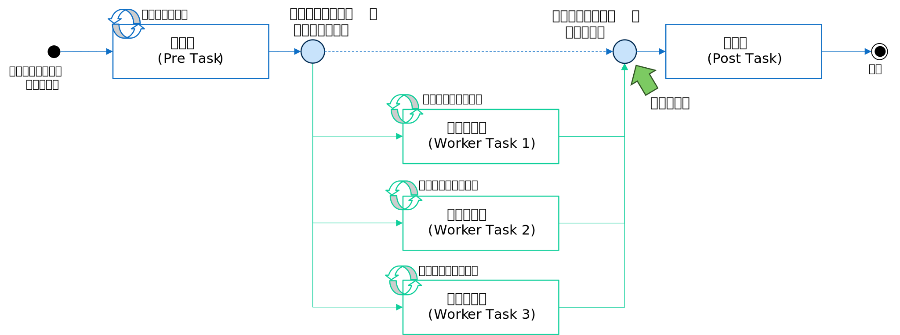
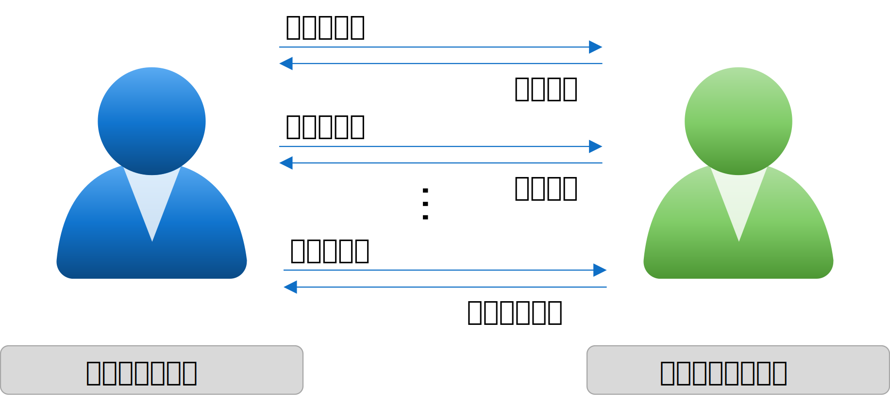
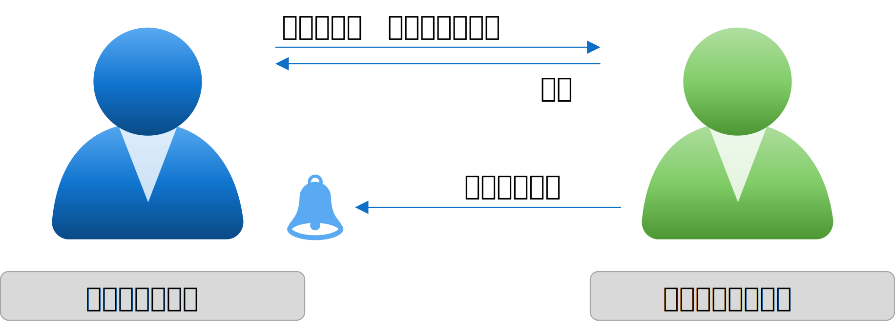

没になった記事や書き換え記事

# スレッドの完了を待機する
マルチスレッドプログラミングを行なう場合、スレッド終了を待機して後続の処理を実行するのは頻出するパターンです。
例えば「対話型アプリケーションで、画面をフリーズさせないように外部への通信を別スレッドで非同期実行して結果を画面に表示する」などがあります。

スレッドの待機は対話型アプリ以外でも様々な場面で発生しますが、ここでは、分かり易いように単純なバッチアプリの流れを例にして「スレッドの完了を待機する方法」を考えてみます。
メインスレッド側から「前処理」から開始して「業務処理」を複数のワーカースレッド実行し、すべてのワーカースレッドの完了を待ち合わせしてから「後処理」を実行する。という単純な例です。

なお、ここで「メインスレッド」はプログラムを処理したスレッドを指し、「ワーカースレッド」はタスクを実行するために新たに作成したスレッドを指します。


<br/>
<div style="text-align: center"></div>
<br/>

## ブロックして待機する

次のソースは、上の図をプログラムで疑似コーディングしたものです。ここでは、全てのワーカースレッドの終了を待ち合わせている部分に着目します。

``` csharp
// 待ち合わせのサンプル
static void BatchJob()
{
    List<Thread> tasks = new List<Thread>();  // タスクリスト

    // 前処理
    PreTask();

    // 業務処理をパラメータを変えて３スレッド作成
    tasks.Add(new Thread(() => { WorkerTask(1); })); // 業務処理１
    tasks.Add(new Thread(() => { WorkerTask(2); })); // 業務処理２
    tasks.Add(new Thread(() => { WorkerTask(3); })); // 業務処理３

    // スレッドの開始
    foreach (Thread t in tasks) { t.Start(); }

    // スレッドの終了待ち
    foreach (Thread t in tasks) { t.Join(); } // ←ここの待機方法を考えてみる

    // 後処理
    PostTask();
}
```

単純にスレッドの完了を待つだけで良いなら ```Join()``` で待機すれば良いのでさほど難しくはありません。
また、Task クラスを用いれば、```Task.WaitAll()```というメソッドが利用できるので、```foreach``` を書く必要がなくさらに簡単に記述できます。

このように、ただ終了を待つだけなら何も難しくありません。
しかし、この例の Join メソッドはスレッドが終了するまで呼び出しから返ってこない（これを「処理がブロックする」と言います）ので、待機している間は、メインスレッドでは何もできません。

これがどういう問題であるかを理解する為に、試しに、スレッドが終了したら終了ステータスを表示するように以下の様に変更してみたとします。

``` csharp
// スレッドの終了待ち（間違いとは言わないがあまり良くない例）
foreach (Thread t in tasks)
{
    t.Join();
    Console.WriteLine("Thread ID:{0} Status:{1}", t.ManagedThreadId, t.ThreadState);
}
```

このコーディングは間違いとは言いませんが、一つ大きな不都合があります。
それは、この実装方法だとスレッドが終了した順番ではなくリストに格納されている順番にログが出力されてしまう点です。
仮に最初のスレッド（業務処理１）が 10 分以上かかるとします。すると、他のスレッドが 1 秒未満で終了したとしても、全てのログが出力されるのは 10 分後です。

これは、ワーカースレッドを待機している間はメインスレッドは何もできないのが原因です。
では、以下の要件の様にスレッドの完了を待機しつつ、別の作業を並行で行ないたい場合はどうしたら良いでしょうか？
- バッチアプリで「スレッドが完了したら、そのスレッドの終了を**すぐに**画面に表示する」
- 対話型アプリで「非同期で実行したスレッドの完了を待ちつつ画面をフリーズさせないようにする」

## 終了を待機する手法
この手の問題を解決する為に、昔から様々なプログラミングパターンが考案されています。C# の APM/EAP/TAP なども、その一例です。
しかし、抽象度の高いフレームワークや C# の async/await の様な便利なシンタックスから勉強してしまうと、マルチスレッドではなく利用しているフレームワークやシンタックスの勉強になってしまうので、
ここでは、もう一段、下のレイヤから話をしたいと思います。

ワーカースレッドの完了を待機しながら、別の作業を並行に行う為には、大きく以下の３つのパターンがあります。

 - ステータスをポーリングする
 - イベントをハンドリングする
 - イベントを監視する

### ステータスをポーリングする
先程の例では Join メソッドがブロックしてしまうので、メインスレッドでは何もできませんでした。
逆を言うと、ブロックしない方法でスレッドの終了をポーリング（定期的に終了したかどうかを確認する）すれば、問題は解決できそうです。
実装イメージを図にするとこんな感じです。

<div style="text-align: center"></div>
<br/>


引数の無い Join は無限に待機するので、処理がブロックする事になりますが、Join の引数には待機する時間を明示的に指定する事ができます。
例えば待機時間に 0 ミリ秒を指定すれば、Join はワーカースレッドの終了だけ確認て直ぐに戻ってくる事が可能です。これを利用して次の様にコーディングします。

``` csharp
// 待ち合わせのサンプル
static void BatchJob()
{
    // ...中略...

    // スレッドの終了待ち
    while (tasks.Count > 0)
    {
        // スレッドがスピンするのを防ぐ
        Thread.Sleep(1000);

        // スレッドを一つづつ確認する
        for (int i = 0; i < tasks.Count; i++)  
        {
            Thread t = tasks[i];

            // タスクが終了しているか、Non-Blocking で確認
            if (t.Join(0) == true)  
            {
                // 終了していた場合、終了したスレッドの情報を表示
                Console.WriteLine("Thread ID:{0} Status:{1}", t.ManagedThreadId, t.ThreadState); 
                // 終了したタスクをリストから削除  
                tasks.RemoveAt(i);    
                // tasks の内容を書き換えたので for ループを抜ける
                break;
            }
        }
    }
    // ...中略...
}
```

このコードだと、Join の引数が 0 ミリ秒なので、全くブロックせず(Non-Blocking)に、ワーカースレッドの終了を確認する事ができます。
このプログラムは問題なく動作しますが欠点もあります。

なお、このコードでは意図的に ```Thread.Sleep(1000)``` を入れていますが、この理由が解りますでしょうか？
この Sleep は while/for のループがフルスピン（全力でぶん回る）しないようにする為のトリックです。
もし、このループがスピンしてしまうと CPU 時間を無駄に大量浪費する可能性があるので、その軽減策です。

一方で、Sleep を入れるとスピンは防げますが、終了確認が一定間隔おきになります（この例の場合は 1000 ミリ秒間隔） 、つまりスレッドが終了してそれを検知するまでに最大 1 秒のタイムラグが発生する可能性があります。
この間隔はチューニングで短かくできますが、どちらにしても、Sleep を入れる事によって、今度は、即時性を要求するタイプのアプリで許容できない問題となる場合があります。

どちらの欠点も、アプリの種類によっては問題にならない事も多いので、この実装がダメな実装という訳ではありません。欠点を理解した上でこの方法を採用するかどうかを決めてください。

**補足説明**
- Sleep の代りに Join の引数で、例えば ```Join(1000)``` としても、スピンを防ぐ事ができます。
ただ、今回のサンプルコードだと、複数のスレッドの Join をそれぞれ呼びだしているので、Join の待機時間を長くすると、確認間隔がさらに長くなってしまう(x スレッド数)ので、今回は Sleep を採用しています。
- Sleep が効果的であるかどうかはアプリの特性にも依存する事も覚えておきましょう。アプリによっては Sleep へ遷移するオーバーヘッドの方が問題となる場合もあります。
特に性能を要求するアプリの場合には、こういった小さい工夫が大きな性能差を生み出します。コーディングの段階では分からない事も多いのでテストしながら最適化を行う必要があります。


### イベントをハンドリングする
スレッドが完了したタイミングでワーカースレッド側でイベントを発生させる（トリガーする）方法です。換言すると、ワーカースレッドが終わったら通知してもらう方法です。
実装イメージを図にするとこんな感じです。実際にはベルを鳴らすのではなく、予め用意したメソッド（イベントハンドラ）をワーカースレッド側から呼びだしてもらいます。


<div style="text-align: center"></div>
<br/>

C# の Thread クラスにはイベントを登録する方法がありませんので、以下のソースは疑似コードです（動きません）が、
仮にスレッドが完了した時に呼び出されるイベントが登録可能ならば以下のようなコーディングになります。
(仮に ThreadEx クラスとします)

``` csharp
// 完了時に呼び出されるイベントハンドラを用意
static void TaskCompleted(object sender, EventArgs e)
{
    // ステータスを表示
    Console.WriteLine("Thread ID:{0} Status:{1}", 
	                   ((ThreadEx)sender).ThreadID, ((ThreadEx)sender).ThreadState);
}

// 待ち合わせのサンプル
static void BatchJob()
{
    // ...中略...

    // 業務処理をパラメータを変えて３スレッド作成
    tasks.Add(new ThreadEx(() => { WorkerTask(1); })); // 業務処理１
    tasks.Add(new ThreadEx(() => { WorkerTask(2); })); // 業務処理２
    tasks.Add(new ThreadEx(() => { WorkerTask(3); })); // 業務処理３

    // イベントハンドラの登録
    foreach (ThreadEx t in tasks) { t.ThreadCompleted += TaskCompleted!; }

    // スレッドの開始
    foreach (ThreadEx t in tasks) { t.Start(); }

    // スレッドが完了した時の処理（この例ではステータスの表示）は 
    // TaskCompleted() 側で実行するので、ここは何もせず。

    // 全スレッドの終了待ち
    foreach (ThreadEx t in tasks) { t.Join(); }

    // ...中略...
}
```


### イベントを監視する


# 開始時の待ち合わせ


# 排他制御の基本
# キャンセルの基本
# 例外処理の基本
# 非同期
 - 非同期の要件
 - Task-based Asynchronous Pattern
 - Event-based Asynchronous Pattern
 - Asynchronous Programming Model
 - asyc/await

