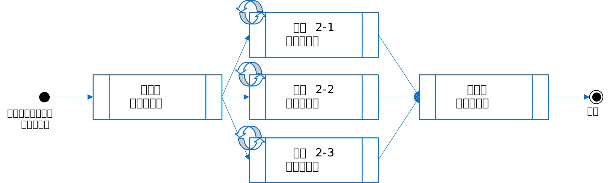
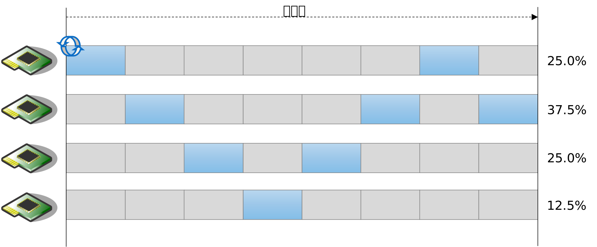
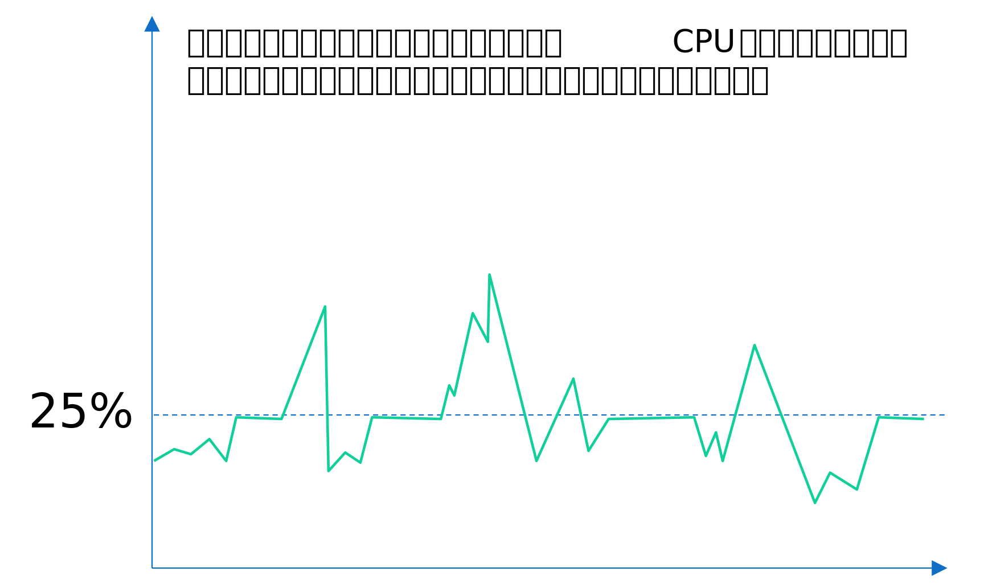
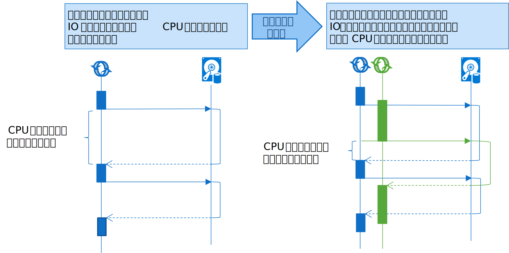
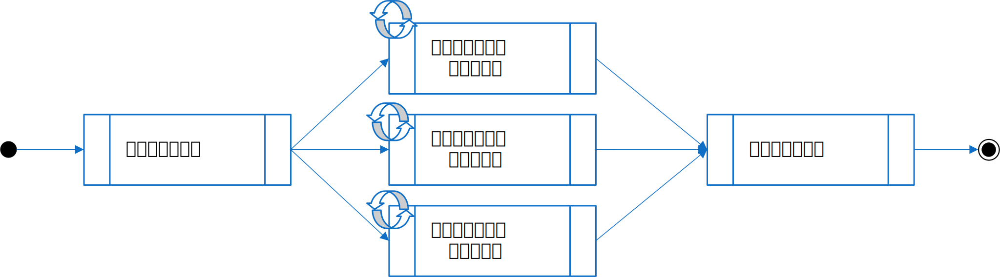
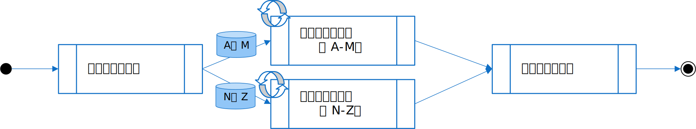

# はじめに
マルチスレッドアプリケーションの設計に関する "あれこれ" を幾つかの記事に分けてシリーズで投稿しています。
本記事ではバッチアプリをマルチスレッド化する時の考慮点について議論しています。



# バッチアプリにおけるマルチスレッドの設計
バッチアプリケーションは、一般的に、処理が開始したあとはユーザーとの対話がなく、大量のデータやタスクを連続して処理するアプリケーションです。例としては画像処理、ビックデータ分析、検索インデックス作成などがあります。
本記事で想定する「バッチアプリケーション」の特性は以下のようなものです。

<br/>
<div style="text-align: center"></div>
<br/>


<ul>
<li>処理の完了までに一定の時間を要する：<br/>大量のデータを処理するか、あるいは暗号計算の様に計算量が多い処理で、処理の完了までに一定の時間(数十秒〜数日)を要するアプリを想定します。</li>
<li>即時応答性は必要ない：<br/>Web アプリの様にユーザーからリクエストに応じて実行結果を返すタイプのアプリではなく、開始をトリガーしたらあとはアプリが終了するまで放っておくタイプのアプリを想定します。</li>
<li>画面を持っていない：<br/>対話型のユーザーインターフェースを持たず、一度バッチアプリが起動したら完了まではユーザーからの操作は原則的に受け付けないタイプのアプリを想定します。</li>
</ul>


小難しく書いてますが、要は皆さんが想像するバッチアプリとほぼ相違ないと思います。

## アプリアーキテクチャ

バッチアプリは、エントリポイント(開始点)から開始して最後までプログラムを順次実行するだけですので、説明が必要なほど複雑なアーキテクチャではありませんが、いちおう例を図示すると次の図のようになります。この例では３のタスクを順番に処理する様子です。

<br/>
<div style="text-align: center"></div>
<br/>

## マルチスレッド化

バッチアプリをマルチスレッド化する主な目的は処理時間の短縮です。
処理を複数のスレッドで分担する事で、単位時間内の処理量を増加させ、全体の処理時間を短縮する効果が期待できます。
また、マルチコアの環境なら、マルチコアの能力を最大限に発揮する為にはマルチスレッド化が必要になります。

<br/>
<div style="text-align: center"></div>
<br/>

しかし、闇雲に並列化すると、逆にパフォーマンスが低下する可能性があります。バッチアプリをマルチスレッド化場合は、そのあたりの仕組みを理解しておく必要があります。


# タスクの特性について
パフォーマンスの向上を期待してマルチスレッドアプリを設計する場合は、CPU 資源を如何に効率的に利用するかを理解する事がポイントです。
それにはタスク(処理)の特性に着目します。タスクの特性には、大きく CPU 主体型と、I/O 主体型があります。
多くのアプリケーションは様々な処理を実装していますので、現実的にはどちらか一方の型に完全に偏る事はありませんが、どちらかの傾向が強いか否かを判断するのは重要です。

## CPU 主体型の場合

あるタスクを実行しているスレッドが、CPU 時間を大量消費(フルスピン)している様な場合、つまり、計算処理の比重が高い場合は、そのタスクは「CPU 主体型」のタスクです。
この手のタスクは、マルチスレッド化する事で複数のコアに処理を分担させる事ができるので、パフォーマンスを向上できる可能性があります。

この状況を理解する為に、まず、下の図を見てください、この図はコアを 4 つ積んだサーバー上で、たった一つの処理スレッドがフルスピンしている(ぶん回っている)様子を示しています。

<br/>
<div style="text-align: center"></div>
<br/>

コアは 4 つなので、トータルで計算すると CPU 使用率は 25.0% (100/400) にしかなりません。また、スレッドの実行は複数のコアを渡り歩いていますので、それぞれの CPU 単位での使用率も 12〜37.5% 程度あります。いずれにしても CPU には余裕があるように見えます。
しかし、この処理スレッドは既に**ボトルネックに直面している**事に注意してください。なぜなら、一つのスレッドだけだと、マルチコアであっても当該の処理は２以上のコアで同時に実行される(並列処理)事はなく、このスレッドは CPU 一つ分のリソースを既に使い切っている状態だからです。
コアをいくつ積んでいるかどうかは全く関係ありません。スレッドが一つなのでマルチコアを有効に使えないのです。

さて、この図から以下の考察を押えておく必要があります。

<ul>
<li>マルチコア環境で CPU 時間を効率良く使用する為には処理をマルチスレッド化する必要がある</li>
<li>CPU 主体型の場合は、スレッド数は最大でもコア数と同数以下にする (←ただし、この表現は誤解が多いので後述の説明も良く読んで下さい)</li>
</ul>


人情的には、コアをより多く積んでいる計算機で実行すれば、アプリのパフォーマンスが勝手に向上するように錯覚しますが、それは誤りです。単純にコアが多ければ良いのではなく、前提としてアプリがちゃんとマルチスレッドで実装されている必要があります。
また、スレッドも多ければ良いという訳ではありません。**並列処理**を行うにはスレッド数はコアの数が上限である事がわかります。それ以上増やしてもスレッドを切り替えながらの並行処理(Concurrent)になり、真の並列処理(Parallel)にはならないからです。
むしろコア数以上にスレッドを増やすとコンテキストスイッチ(スレッドの切替処理)のオーバーヘッドが増えてかえって遅くなる可能性があります。

**《スレッド数の最大数とコア数の関係》** <br/>

ここで「スレッド数は最大でもコア数と同数以下」と記載しましたが、この記述は誤解を生みやすいので補足します。

確かに、スレッドが**フルスピン**している状況では、スレッド数の最大数はコア数以下にするのが「適切」です。それ以上増やしたところで CPU に余裕が無いのでパフォーマンスは向上しません。
ところが、実際には殆どのアプリケーションでコア数を越えてスレッド数を増やした方が結果的にパフォーマンスが向上します。それは、詳しくは順を追って説明しますが、殆どのアプリは処理の途中で何かしらの「待ち」が存在するからです。
この為「スレッド数の最大数はコア数以下にすべき」と単純に覚えてはいけません。

**《スレッドがフルスピンしている時のグラフ》** <br/>

参考までに。<br/>
一つのスレッドがフルスピンしている時に CPU 使用率のグラフを見ると以下の様に横線が確認できる場合があります。
常にこの様に綺麗なグラフになるとは限らないのですが、もしこの横線が確認されたら、スレッド数が不足している可能性があるので、トラブルシューティングの参考として覚えておくと良いと思います。

<br/>
<div style="text-align: center"></div>
<br/>

## I/O 主体型の場合

「待ち」時間あるスレッドは、その「待ちの時間」は CPU が**暇**している時間と言い換えられます。マルチスレッド化して、その暇な時間を別のスレッドに譲ることができれば CPU を効率よく使用できる事が期待できます。
ここで言う「待ち」とは、スレッドが CPU 時間を消費しない時間を指しています。例えばネットワーク通信の応答待ちの間は CPU は消費しません。ファイル I/O でも同様です。
待ちの代表例が I/O (入出力) なので、このタイプを 「I/O主体型」 のタスクと言います。
IO 以外にもプログラムから明示的に Sleep を呼びだした場合や、同期オブジェクト (セマフォや Mutex 等) を待機している場合も「待ち」に該当します。

<br/>
<div style="text-align: center"></div>
<br/>

この場合の「適切な最大スレッド数」がいくつになるか、これは一律には決められません。なぜならプログラムの作り次第で変るからです。よって、CPU 時間を効率良く使えるスレッド数を負荷試験をしながら探る事になります。おそらくコア数より多いスレッド数になる筈です。
このような、ファイル入出力やネットワーク通信などの「待ち」の時間は、よほど計算に特化した処理を実装するアプリでもない限りは、ほとんどのアプリに存在します。つまり、ほとんどのアプリにとっては、スレッド数をコア数**以上**にして並列・並行処理をした方が全体のパフォーマンスが向上する可能性があります。

# マルチスレッド化の戦略
「バッチアプリケーション」をマルチスレッド化する場合は、処理時間の短縮が主な目的です。
例えば数百万件の顧客データの処理が何時間〜何日もかかる場合に、これをできるだけ短縮したい場合などです。

マルチスレッド化の戦略には大きく二つあります。

## タスクで分割する

数百万件の顧客データについて、各種統計データを、それぞれ住所別／年齢別／職業別で算出する処理があった場合、これらの処理は並列(or並行)で行なう事ができます。
この様に処理(タスク)の種類毎にマルチスレッド化する方法は「タスクで分割する」の戦略になります。

<br/>
<div style="text-align: center"></div>
<br/>


### タスク分割とパフォーマンス

タスクで分割すると、本当にパオーマンスが向上するのかどうか、ソースコードを見ながら少し考察してみたいと思います。
以下のソースは、MyTask1, MyTask2, MyTask3 という 3 つタスクを、一つのループで実行するプログラムです。

``` csharp
static void SingleThreadExample()
{
    // データベースなどからデータを取得する
    // なお、説明の都合上、大量データによるメモリ不足の可能性については考慮しない事とします。
    List<Record> records = GetRecords();

    // 全件ループ
    foreach (Record rec in records)
    {
        MyTask1(rec);  // 処理１
        MyTask2(rec);  // 処理２
        MyTask3(rec);  // 処理３
    }
}
```

このソースはスレッドを作成していないので、シングルスレッドで動作する事になります。つまり、全てのタスクがシリアル(直列)に実行されます。
そこで、それぞれのタスクを別々のスレッドで実行できるように次の様に書き換えます(タスクで分割してみます)。

``` csharp
static void MultiThreadExample()
{
    // データベースなどからデータを取得する
    List<Record> records = GetRecords();

    // タスクリスト
    List<Task> tasks = new List<Task>();

    // 処理１を行うスレッド
    tasks.Add(Task.Run(() =>
    {
        // 全件ループ
        foreach (Record rec in records)
        {
            MyTask1(rec);  // 処理１
        }
    }));

    // 処理２を行うスレッド
    tasks.Add(Task.Run(() =>
    {
        // 全件ループ
        foreach (Record rec in records)
        {
            MyTask2(rec);  // 処理２
        }
    }));

    // 処理３を行うスレッド
    tasks.Add(Task.Run(() =>
    {
        // 全件ループ
        foreach (Record rec in records)
        {
            MyTask3(rec);  // 処理３
        }
    }));

    // 全スレッドの終了待ち
    Task.WaitAll(tasks.ToArray());
}
```

さて、ここでソースを見比べてみます。```SingleThreadExample()``` がループが一つなのに対し、```MultiThreadExample()``` は全件ループが三つです。
仮に全件で100万回のループが必要だったら、```MultiThreadExample()``` は合計で 300万回のループが必要になるので、一見、遅くなるように思えます。
しかし、タスクを複数の CPU に分担できればパフォーマンスの向上の可能性があります。

次の表は、CPU 主体型とI/O 主体型でパフォーマンスが向上するかどうかを示したものです。

 |                | **マルチコア環境** | **シングルコア環境** |
 | **CPU 主体型** | ○向上の可能性       | ×悪化の可能性       |
 | **I/O 主体型** | ○向上の可能性       | ○向上の可能性         |


**《CPU 主体型の場合》** <br/>
- マルチコアの場合、パフォーマンスの向上の可能性があります。

MyTask1〜MyTask3 の各タスクが非常に重い計算処理の場合、マルチコア環境ならば、マルチスレッド化する事で、各コアで処理を分担できる(**並列処理**)ようになりますので、パフォーマンスが向上する可能性があります。

- シングルコアの場合、パフォーマンスが悪化する可能性があります。マルチスレッド化しただけではパフォーマンスが向上するとか限らない例です。

もし CPU を一つしか積んでいないシングルコアの計算機で実行した場合は、マルチスレッド化されていてもプログラムは**並行処理**で実行される事になり、
実質的に 300 万回分のループを一つのコアで処理する事になり、パフォーマンスが悪化する可能性があります。

**《I/O 主体型の場合》** <br/>
- シングルコアかマルチコアかに関わらず、パフォーマンスの向上の可能性があると考えられます。

MyTask1〜MyTask3 の各処理(各メソッド)の中で大量の IO (ファイル読み書きやネットワーク通信) を行なっているケースを考えます。
この場合、IO 待ちの間は CPU が **暇** している時間になりますが、シングルスレッドで実装されている限り、暇な時間に、別の処理を実行する事ができません。
そこで、あるスレッドで IO 待ちが発生している間に別のスレッドの処理を実行できれば、その分だけ全体の処理を早く完了させる事ができます。

## データで分割する

数百万件の顧客データについて、各種統計データを算出する処理があった場合、全件を頭からシリアル(シングルスレッド)で処理するのは時間が掛る為、
例えば、前半の A-M で始まる名前の顧客データと、後半の N-Z で始まる名前の顧客データを 2 つに分けてそれぞれを並列(or並行)で集計した方が早く終りそうです(もちろん、業務観点(データ観点)でも分割可能である必要あり)
この様に、データで分割する方法は「データで分割する」の戦略になります。

<br/>
<div style="text-align: center"></div>
<br/>

### データ分割とパフォーマンス

先程と同じ様に、データで分割すると、本当にパオーマンスが向上するのかどうか、ソースコードを見ながら少し考察してみたいと思います。
先程のソースを使って、今度はデータで分割した例を見てみましょう。データ分割でマルチスレッド化した場合、例えば以下の様になります。

``` csharp
static void MultiThreadTask()
{
    // データベースなどからデータを取得する
    List<Record> records = GetRecords();

    // データ分割位置
    int count = records.Count;
    int half = count / 2;

    // タスクリスト
    List<Task> tasks = new List<Task>();

    // 前半のデータを処理するスレッド
    tasks.Add(Task.Run(() =>
    {
        // 前半ループ
        for(int i = 0; i < half; i++)
        {
            Record rec = records[i];
            MyTask1(rec);  // 処理１
            MyTask2(rec);  // 処理２
            MyTask3(rec);  // 処理３
        }
    }));

    // 後半のデータを処理するスレッド
    tasks.Add(Task.Run(() =>
    {
        // 後半ループ
        for (int i = half; i < count; i++)
        {
            Record rec = records[i];
            MyTask1(rec);  // 処理１
            MyTask2(rec);  // 処理２
            MyTask3(rec);  // 処理３
        }
    }));

    // 全スレッドの終了待ち
    Task.WaitAll(tasks.ToArray());
}
```

このソースの場合、全件ループの総数は元のソース(シングルスレッド版)と変わらないですが、データを分割する事で、各スレッドでのループ回数を半分に減らしています。

次の表は、CPU 主体型とI/O 主体型でパフォーマンスが向上するかどうかを示したものです。

 |                | **マルチコア環境** | **シングルコア環境** |
 | **CPU 主体型** | ○向上の可能性       | △悪化の可能性       |
 | **I/O 主体型** | ○向上の可能性       | ○向上の可能性         |


**《CPU 主体型の場合》** <br/>
- マルチコアの場合、パフォーマンスの向上の可能性があります。

先程と同様の議論になりますが、マルチコア環境ならばそれぞれのループを別々の CPU で並列実行できる為(ループ回数が半数になっている)、パフォーマンスの向上が期待できると考えられます。

- シングルコアの場合、パフォーマンスが悪化する可能性があります。

シングルコアの場合には、処理を分担する事ができませんから、一つの CPU が全件のループを回す事になり、マルチスレッド化しても殆どパフォーマンスは向上しないと考えられます。
ループの総数は変らないので、大きな悪化にはないかもしれませんが、代りにコンテキストスイッチが増えますので、パフォーマンスは若干悪化すると考えられます。

**《I/O 主体型の場合》** <br/>
- シングルコアかマルチコアかに関わらず、パフォーマンスの向上の可能性があります。

I/O 主体型の場合は「待ち」の時間に別のスレッドを並列・並行処理する事ができるので、結果的にパフォーマンスの向上が期待できると考えられます。


# Parallel ライブラリの利用
前述の様に、パフォーマンスを目的とするならシステムのコア数を見てスレッド数の調整を行なう場面が出てきます。
しかし、ミドルウエアの開発者ならともかく、業務アプリの開発者からみると、いちいち動作環境のコアの数まで考慮してロジックを組むのはナンセンスなので、自動で調整してくれると便利ですね。

C# にはタスクやデータで分割する為の専用の API が用意されており、これら API を利用するとプログラムを動作させているシステム環境に基づいて自動的に複数のスレッドでスケジューリングしてくれます。
ここで「システム環境」が具体的に何を指すのかはドキュメントに明記が無いのでブラックボックスですが、要はコア数(やその他の要素？)を考慮してスレッド数を調整してくれるという意味と解釈できます。

ですので、実際にバッチアプリを開発する場合は、以下に説明する Parallel ライブラリを積極的にご利用ください。

## タスク分割の実装例

Parallel.Invoke メソッドを使用すると、タスク分割のソースは以下のように書き換える事ができます。

``` csharp
static void MultiThreadTask()
{
    // データベースなどからデータを取得する
    List<Record> records = GetRecords();

    // 複数のタスクを並列・並行実行する
    Parallel.Invoke(
        () =>
        {
            // 全件ループ
            foreach (Record rec in records)
            {
                MyTask1(rec);  // 処理１
            }
        },
        () =>
        {
            // 全件ループ
            foreach (Record rec in records)
            {
                MyTask2(rec);  // 処理２
            }
        },
        () =>
        {
            // 全件ループ
            foreach (Record rec in records)
            {
                MyTask3(rec);  // 処理３
            }
        });

    // Task.Wait は不要(Parallel.Invokeが適切に実施してくれる)
}
```

## データ分割の実装例

Parallel.ForEach, Parallel.For メソッドを使用すると、上のソースは以下のように書き換える事ができます。
以下は Parallel.ForEach を使用した例です。

``` csharp
static void MultiThreadTask3()
{
    // データベースなどからデータを取得する
    List<Record> records = GetRecords();

    // Parallel Foreach を使ってデータ分割する
    Parallel.ForEach(records, rec =>
    {
        MyTask1(rec);  // 処理１
        MyTask2(rec);  // 処理２
        MyTask3(rec);  // 処理３
    });
}
```

なお、C# にはこの他に LINQ を使用した並列化の実装方法がありますが、本記事では割愛します。興味のある方はマイクロソフトのドキュメントを検索、参照ください。

## まとめ

- タスクには「CPU 主体型」と「I/O 主体型」の二種類の特性(傾向)がある
  - タスク並列化を検討する時は、当該のタスクが「CPU 主体型」の傾向があるのか「I/O 主体型」の傾向があるのか見分ける事が重要<br/>
<p/>
- バッチアプリのタスクをマルチスレッド化するには、大きく２つの戦略がある
  - タスクで分割する
  - データで分割する
<p/>
- タスクの並列化には、プログラムを動作させているシステム環境の考慮が必要になる場合がある<br/>
  ⇒ 自前でこれを実装するのはナンセンスなので C# の Parallel ライブラリ等、ご利用の言語に付随の機能を積極的に利用しよう
