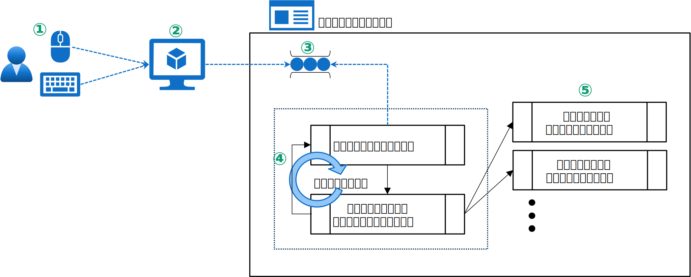
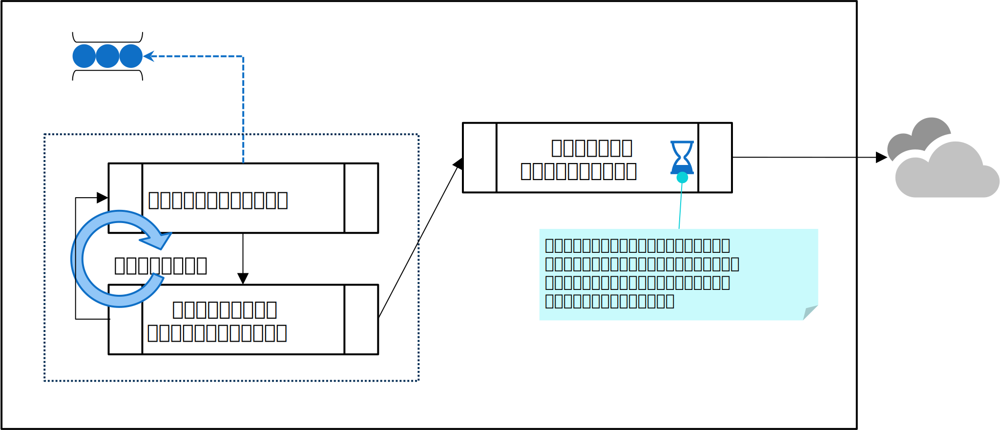
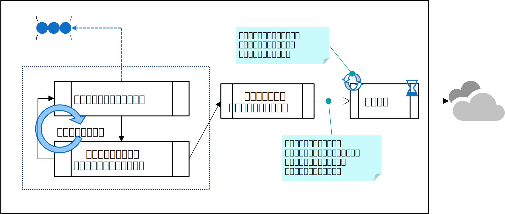

# はじめに
マルチスレッドアプリケーションの設計に関する "あれこれ" を幾つかの記事に分けてシリーズで投稿しています。
本記事では対話型アプリをマルチスレッド化する時の考慮点について議論しています。



# 対話型アプリにおけるマルチスレッドの設計
ここで言う対話型アプリケーションとは、デスクトップアプリやスマホ上で動作するモバイルアプリ、あるいは Web のフロントエンド(ブラウザ)側など、グラフィカルインターフェースがあり、ユーザーと対話するタイプのアプリケーション全般を想定します。
これらのアプリケーションは、画面上のボタンをクリックしてその結果を画面に表示させるなど、ユーザーのアクションに対応して処理が実行される動きが特徴です。
例としてはメールアプリ、オフィスアプリ（Excel, Word）、地図アプリ、日記アプリ、様々なモバイル端末アプリなどがあります。

## アプリアーキテクチャ

対話側アプリにおいて、最初に理解しておかなければならないのは**メッセージループ**の存在でしょう。メッセージループの存在を知らずして、対話型アプリをマルチスレッド化する目的を理解するのは難しいと思います。

ここでは最初にメッセージループのアーキテクチャについて簡単に説明します。もしあなたがメッセージループが何かを既に理解されているならば、ここは読み飛ばして頂いて大丈夫です。

### メッセージループ

対話型アプリは、ユーザーの操作をイベントとして拾い、そのイベントに対応するイベントハンドラをコーディングする形でアプリを実装していきます。
例えば、ユーザーがマウスでボタンをクリックしたら、そのイベントに対応する「ボタンクリックイベント」のイベントハンドラをコーディングします。

まずは、ユーザーがマウスをクリックしてからイベントハンドラを呼び出すまでの流れを概説してみたいと思います。

 

 

図を見ながら順番に見ていきましょう。 

① ユーザーがマウスやキーボードを操作してイベントを発生させます。これらは、人の操作なので、アプリのスレッドとは全く無関係に発生する非同期的なイベントです。

② ユーザーの操作で発生するイベントは、例えば「マウスが現在座標から X,Y 方向に何ピクセル動いた」「座標 X,Y でマウスクリックした」の様に、そのままではアプリにとっては扱い辛いイベントです。オペレーティングシステムやランタイムは、これらイベントを「ボタンクリック」などの、アプリにとって意味のあるイベントに変換してからアプリに通知します。

③ 発生したイベントをそのタイミングでつ通知されると、アプリはユーザーの操作のタイミングで毎回割り込み処理を実装する必要があり極めて複雑な作りになってしまいます。そこで、イベントを順番に処理できるようにする為に、一旦、イベントをキューに入れます。

④ アプリはキューに入ったイベントを順番にシリアルに**シングルスレッド**で処理します。この処理を担っているのが「メッセージループ」です。

⑤ イベントハンドラの中では、イベントに応じた処理を実装します。

ここで、ポイントとなるのが③と④です。対話型のアプリは**マウスの操作やキーボードの打鍵などの非同期的に発生する人の操作を、シングルスレッドでシリアルに処理している**のです。
なお説明上、ユーザーからイベントを例に挙げましたが、「画面の更新」など内部的に発生するイベントも含めて全てのイベントはキューされてから順番に処理されます。

## マルチスレッド化

前述したように、対話型アプリは様々なイベントをスレッドで順番に処理します。よって、もしどこかの処理で時間が掛ってしまう場合、次のイベントの処理が待たされる事になります。
例えば、ボタンクリックイベントの中でネットワーク通信を行っていたと仮定します。もしネットワークが遅くて通信に時間が掛ってしまった場合、通信中はメッセージループに戻る事ができませんので、画面を更新しようとしても、その更新イベントが待たされます。

 

 

この様に、ユーザーがボタンをクリックしたら、何分間も結果が戻らずに画面がフリーズしてしまうようなアプリは、非常にユーザビリティが悪いですね。
この問題の解決策は、時間のかかる処理をバックグラウンドスレッドで実行(非同期実行)させる方法です。これによりユーザビリティの改善を期待する事ができます。

 

 

時間が掛る通信処理を別スレッドに移す事で、メインループでは次のイベントを処理する事ができます。これにより画面のフリーズなども回避され、ユーザビリティの改善する事ができます。

対話型アプリでマルチスレッドを利用する主な目的は、この非同期化によるユーザビリティの改善にあります。しかし、非同期処理を実装する事は、いうほど簡単な作業ではありません。幾つかの考慮点がありますので、それらを見て行きましょう。

# 非同期処理化
## 非同期アーキテクチャ
# その他の検討ポイント
## 排他制御の設計
## UI スレッドへのポスト
## キャンセルの設計
# C# による実装
