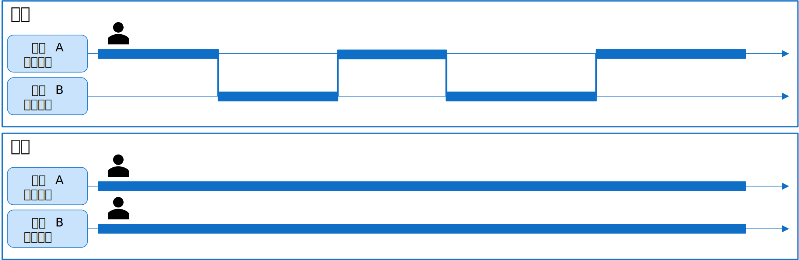

# 基本編
マルチスレッドアプリケーションの設計に関する "あれこれ" を幾つかの記事に分けてシリーズで投稿しています。
本シリーズでは、アプリ種類毎に分けてマルチスレッドアプリケーションについて解説しますが、基本的なところは独立した投稿で説明したいと思います。



# マルチスレッド用語の整理
本シリーズを読み進める前に、マルチスレッド界隈でよく使われる用語をいくつか整理しています。

それぞれの用語について使用する人によって、意味に揺れが存在するケースもあり、著者がどのような「意味」でこれら用語を使用しているのかを事前に理解しておくと、後続の記事が読みやすくなると考え、すこし整理しました。

## プロセスとスレッド

<br/>
<div style="text-align: center"></div>
<br/>

**《プロセス》**<br/>
プロセスとは、プログラムを実行する時に必要な資源一式を管理する機能単位です。
計算機が、あるプログラム処理を実行するには、OS が各処理に CPU 時間やメモリなどの様々な資源を割り当てる必要があります。
プロセスとは、プログラムを実行する為に、OS がメモリなどの各資源の割り当てを行う機能の一つです。
プロセス同士はメモリ空間を含む資源の管理が独立しており、プロセスが異なれば互いに干渉しないように設計されています。
この機能により、例えばあるプロセスがクラッシュしてもその他のプロセスには影響しないようになっています。

初期のころの OS では、プログラムを実行する実体もプロセスでした。
しかし、その後スレッドの登場でプログラムを実行する実体はスレッドになりました。
プロセスは、資源管理を行なう区画としての機能はそのままですが、現在はプロセスそのものは**動かない**と考えます。

なお、ややこしいのですが、文脈や話題の背景によっては「プロセスがプログラムを実行する」と表現する場合もあります。
なので、厳密にはプロセスの実体は動かないけど、表現上は「動く」とする場合はある、くらいに理解していると良いかと思います。

**《スレッド》**<br/>
スレッドとはプロセスの内部で、実際に CPU 時間をスケジューリングして処理を実行する実体であり、プログラムを実行する処理フローそのものを指します。

前述の通り、昔はプロセスは資源管理を行う区画であると同時にプログラムを実行する実体でした。
この為、複数のプログラムを同時実行する為にはプロセスを複数同時実行（マルチプロセス）させる必要がありました。
しかし、計算機の資源は限られています。プロセスが多すぎる場合、プロセス一つ一つにメモリなどの資源を個別に割り当てるとリソースが不足する可能性が高くなります。
そこで、同一のプロセス内で、メモリなどの資源を共有しつつ、プログラムの処理の実行だけを複数同時実行するように「スレッド」という機能が生まれました。
スレッドはプロセスの中でメモリ資源などを共有しながら、プログラムを実行する実体になります。

## ジョブとタスク

<br/>
<div style="text-align: center"></div>
<br/>

ジョブやタスクという術語は、文脈や製品によって微妙に異なる意味で使われます(→意味の「ゆれ」があります)。

例えば、一部のジョブ管理システムでは、ジョブやタスクはロジックを組む為の具体的な機能実体です。
Windows OS でのジョブオブジェクトとは一つ以上のプロセスをグループとして制御する機能です。
csh や bash などのシェルからコマンドラインとして起動するコマンド郡をジョブと言います。
実行中のプロセスの事を指してタスクと言う場合があります。C# (.NET) には Task という名前の非同期(スレッド)実行を支援するクラスライブラリがあります。

本記事では厳密に用語を定義する事はしません。以下のように「抽象的」に、ざっくりとした意味で押さえてください。

**《ジョブ》**<br/>
目的を達成する為の一連(複数)のタスクの集まりを意味します。ジョブを構成する個々の処理をタスクと呼びます。

**《タスク》**<br/>
「タスク」は「処理」「作業」又は、当該処理を実装している「プログラム」を指す言葉として使います。

## 並列と並行

<br/>
<div style="text-align: center"></div>
<br/>

プログラムの処理を複数の処理の流れで同時に実行する場合、大きく並行と並列の２種類の方式があります。
アプリでマルチスレッドをプログラムする場合は、これらの方式の違いをプログラムから制御する事はしません。
というより、通常は OS やスレッドライブラリが良き様にはからってくれるのでプログラマは意図的に制御しないのが普通です。

しかし、これらの概念を意識する事はマルチスレッドアプリの設計する上では重要です。プログラムからの操作方法を詳しく理解する必要はありませんが、両者の概念の違いについては理解する必要があります。

**《並行 - Concurrent》**<br/>
一つの CPU (作業者) が、コンテキストを切り替えながら複数の処理を同時実行する。例えるなら一人の人が洗濯や掃除を同時並行でこなす様。

**《並列 - Parallel》**<br/>
複数の CPU（作業者）が、複数の処理を同時実行する。例えるなら、二人以上の人が洗濯と掃除を分担でこなす様。

なお、並列と並行を区別する必要がない文脈では、いちいち「並列・並行」と書くのは冗長なので、単に「並列」という場合があります。


## 同期と非同期

よく「非同期」という術語がマルチスレッドプログラミングの話題と一緒にでてきますのでこの術語についても触れておきます。

<br/>
<div style="text-align: center"></div>
<br/>

「非同期」の対義語は「同期」です。これらの用語はプログラムの処理アーキテクチャを意味します。複数の処理において、動作のタイミングを合せるか否かの違いがあります。

**《同期 - Synchronous》**<br/>
スレッド等がお互いにタイミングを取って動作する様を「同期を取る」と表現します。
ある処理(関数など)を呼びだしたとき、その処理の**完了を待つ(応答を待つ)**アーキテクチャの事は同期処理と呼びます。プログラムで通常の関数の呼び出しは同期処理です。

**《非同期 - Asynchronous》**<br/>
スレッド等がお互いにタイミングを合せる事もなく、それぞれが好き勝ってに独立して動作する様を「非同期的に動作する」と表現します。
ある処理(関数など)を呼びだしたときに、その処理の **完了を待たずにすぐ復帰する(応答を待たない)** アーキテクチャの事を非同期処理と呼びます。

**《非同期処理とスレッド》**<br/>
非同期処理を実装する手段の一つとしてスレッドが利用できます。例えば「バックエンドで Web サーバーに接続(通信)しながら、画面の操作を行なう」ようなアーキテクチャは、通常スレッドで実装する事になるでしょう。

一方で「非同期」という言葉はあくまでアーキテクチャを指しますので、実装方法としてはスレッド以外でもありえます。
例えば、画像編集アプリから印刷ボタンで印刷を開始すると、印刷処理はプリンタという別のハードウエアで並列に動作しつつ、
アプリは印刷終了を待たずに操作を継続する事ができます。この場合、非同期処理はハードウエアを利用して実現していると言えます。

# マルチスレッドのデザインパターン

マルチスレッドや非同期処理を実装する時のデザインパターンは、歴史と共に幾つかの方法が提供されてきました。C# では以下のデザインパターンがあります。ちなみに、APM と EAP は古い方法なので、現在、推奨されるデザインパターンは TAP と async/await です。
-  [APM (Asynchronous Programming Model)](https://learn.microsoft.com/ja-jp/dotnet/standard/asynchronous-programming-patterns/asynchronous-programming-model-apm)
-  [EAP (Event-based Asynchronous Pattern)](https://learn.microsoft.com/ja-jp/dotnet/standard/asynchronous-programming-patterns/event-based-asynchronous-pattern-eap)
-  [TAP (Task-based Asynchronous Pattern)](https://learn.microsoft.com/ja-jp/dotnet/standard/asynchronous-programming-patterns/task-based-asynchronous-pattern-tap)
-  [async/await](https://learn.microsoft.com/ja-jp/dotnet/csharp/asynchronous-programming/)

他の言語やランタイムでも同様に何かしらのデザインパターンやそのライブラリが提供されていると思います。
マルチスレッドや非同期処理を学習する上で、これら先人達の工夫の結晶であるデザインパターンを学習する事は凄く勉強になります。

しかしながら、最初から便利な方法に頼ると、その裏側にある本質の部分が見えなくなってしまうリスクがあります。本記事では、敢えて言語やライブラリに依存しない基本の部分に立ち返って順に学習しようと思います。
以下の順番でみていきます。

1. スレッドの起動方法（バックグラウンドスレッドにタスクをどうやって実行させるか）
1. スレッドの待機方法（バックグラウンドスレッドの終了をどうやって検知するか）
1. 実行結果の取得方法（バックグラウンドスレッドの処理結果をどこにどうやって取得するか）
1. 例外のハンドリング（例外が発生したときに、どのようにハンドリングするか）
1. スレッドの取消方法（バックグラウンドスレッドを途中でキャンセルするには）

どの言語でどのライブラリを使用してプログラミングした場合でも、最初の３つの機能は、必ずなんらかの方法で実装されています。
残りの２つについてもほとんどのライブラリで実装されていると思われます。

## スレッドの起動

最も簡単なマルチスレッドプログラムを作成しながらスレッドの起動方法を理解します。既に C# でマルチスレッドプログラミングの経験がある方には簡単な例ですので、肩慣らし程度にお読みください。

### Thread クラスを使用した例

マルチスレッドのプログラミングは概ね以下の手順になります。

1. 別スレッドで処理させるロジックをメソッドの形で実装する
1. スレッドを作成する。この時 1. で作成したメソッドを引数に渡す。なお C# の場合はデリゲートと呼ばれるオブジェクトで渡す
1. スレッドを開始する
1. 別スレッドの終了を待機する(Joinする)


``` csharp
using System.Threading;
// ...中略

// 1. スレッドで処理するロジック（メソッド）を定義します
static void Run(object count)
{
    int max = (int)count;
    for(int i=0; i<max; i++)
    {
        Thread.Sleep(1000);
        Console.WriteLine("Thr: {0}", i);
    }
}

static void Main(string[] args)
{
    // スレッドで処理するメソッドに渡す引数
    int count = 10;
    // 2. デリゲート（関数ポインタやコマンドパターンに相当）を引数にしてスレッドを作成します
    Thread thr = new Thread(new ParameterizedThreadStart(Run));
    // 3. スレッドを開始します
    thr.Start(count);
    // 4. スレッドが終了するのを待機します
    thr.Join();
}
```

なお、この例は Thread クラスを使用した最も基本的な実装方法です。C# (他の言語でも)ももっと便利なシンタックスが沢山あり最近はこの様な実装を行なう事は少いかもしれません。
ただ、便利なシンタックスを使ってしまうと、中身をよく理解せずに使えてしまう所があるので、最初は、このプログラムの様にベタな方法で勉強すると良いと思います。

### Task クラスとクロージャを使用する

次は、.NET Framework 4 で導入されたタスクベースの非同期パターン(TAP)で使用される Task クラスを使用した例を示します。Thread クラスをそのまま利用する場合との大きな違いはスレッドプールで実行される事です。その他にもいろいろ便利な機能が備わっており、C# でマルチスレッドをプログラミングする場合は、本クラスを多用する事になると思います。

クロージャ(ラムダ式)はマルチスレッドの機能ではありませんが、クロージャを利用する事によりマルチスレッドのプログラムが画期的に書き易くなる為、一緒に理解しておきたいシンタックスです。なお、ここでは Task と一緒に利用する例を示しますが Thread クラスと一緒に使用する事も可能です。
クロージャを利用するとスレッドから呼び出す関数を予め定義する必要がありません。さらに、**クロージャの外側にあるローカル変数を自由に参照及び書込みできる点**が極めて便利です。
本記事では詳しく説明していませんが、クロージャ及びラムダ式について馴染みの無い方は是非勉強しておく事をお勧めします。


1. スレッド(タスク)を作成し実行する。この時クロージャ(ラムダ式)をその場で定義して渡す
  - スレッドはスレッドプールで自動で実行開始される
  - 引数 count はクロージャの性質を利用してローカル変数で渡しているので、ここでは指定しない
1. 別スレッドの終了を待機する場合は Wait する

``` csharp
using System.Threading;
using System.Threading.Tasks;
// ...中略

static void Main(string[] args)
{
    // クロージャに渡す値
    int count = 10;

    // 1. スレッドを作成して開始する。引数にはスレッドで実行する処理の実体をクロージャで渡す
    Task tsk = Task.Run(() =>
    {
        // クロージャの外側のローカル変数(count)が、クロージャの中から参照も書込みもできる!
        int max = count;  // もし書き込みがある場合は排他制御が必要なので注意
        for (int i = 0; i < max; i++)
        {
            Thread.Sleep(1000);
            Console.WriteLine("Thr: {0}", i);
        }
    });

    // 2. スレッドが終了するのを待機します 
    tsk.Wait();
}
```

他の言語を利用されている場合でも、ベタでスレッドを起動する方法とスレッドプールを利用する方法の 2 パターンは、時に使い分ける必要があるので方法を押えておく事をお勧めします。
なお、スレッドプールについては別の記事で説明します。

## スレッドの待機方法

例えば、バックグラウンドスレッドでデータベースからレコードの読み取りしており、読み取りが完了した時にメインスレッド側ではどうやってそれを検知すれば良いでしょうか？
スレッドの終了を待機するには、大きく３つの方法があります。

- ステータスポーリング
- イベント通知
- イベント監視

なお、ここで紹介する方法はかなりベタな書きかたです。

### ステータスポーリング

バックグラウンドスレッドの終了を検知するには、メインスレッド側で定期的にスレッドのステータスをポーリングします。

### イベント通知
### イベント監視


## 実行結果の取得方法

## 例外のハンドリング

## スレッドの取消

# 排他制御

# async/await

