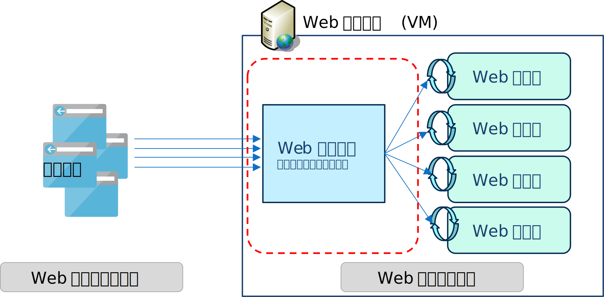
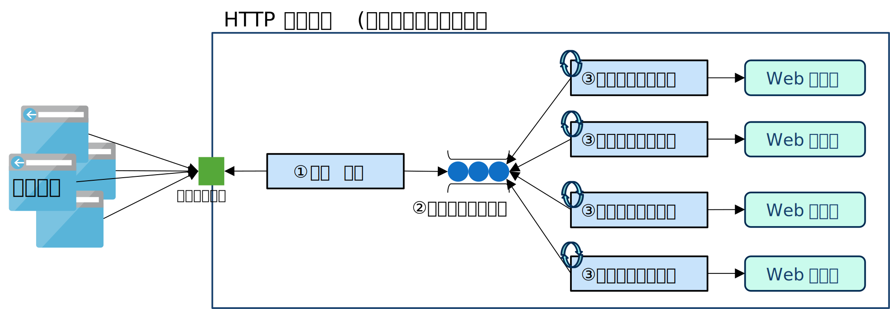

# はじめに
マルチスレッドアプリケーションの設計に関する "あれこれ" を幾つかの記事に分けてシリーズで投稿しています。
本ページではサーバーアプリを実装する時の考慮点について議論しています。



# サーバーアプリにおけるマルチスレッドの設計
ここで説明するサーバーアプリとは、複数のクライアントからの処理を同時並行的に処理するタイプのサービスアプリケーション(サービス・デーモン)全般の事です。
代表例が Web サーバー (HTTP サーバー) です。以降の説明では、サーバーアプリの代表として Web サーバーを例に挙げて説明します。

 

 

## アプリアーキテクチャ

Web サーバーのアーキテクチャも正確に説明しようとすると枝葉の話が多くなってシンプルに話ができなくなってしまうので、ここでも簡略化して説明します。

 

 

図を見ながら順番に見ていきましょう。

① 受信処理がブラウザ(ユーザー)からのリクエストを受信します。

> この「受信処理」の中身に興味がある方も多いかもしれません。いわゆる「マルチ IO」処理です。しかし、今回は、後続の処理（スレッドプール）に着目したいので詳細は省略します。今は「受信処理」では不特定多数からの非同期なリクエストをうまく処理していると考えてください。

② 受信したリクエストは、一旦、「リクエスト・キュー」にキューイングされます。

③ 複数のワーカースレッドが、キューからリクエストを取り出して処理します。

ここで、着目したいのが②と③です。ここはいわゆる「スレッドプール」と呼ばれるアーキテクチャになります。

## マルチスレッド化

複数のユーザからのリクエストを処理するのだから、マルチスレッドで実装するのは自明にも思えますが、もう少し具体的に言うと、以下を改善する為にマルチスレッド化します。

 - 単位時間当りの処理量の増加（スループット）
 - 応答時間の改善（レスポンスタイム、レイテンシ、ラウンドトリップタイム）

「単位時間の処理量」とは、単位時間(例えば 1 秒)内に、どれだけのデータを処理できるかを表す指標です。ネットワーク話ならデータ転送量を指しますが、Web サーバーの場合はリクエスト件数 (Requests/Second) を指す事が多いです。
マルチスレッド化によって並列度を上げれば、単位時間当りの処理件数を増やす事ができるのは、説明するまでもないでしょう。

「応答時間」とは、具体的にはユーザーがリクエストを送信してから応答を受けとるまでの時間です。さらに細かくみると「応答時間 ＝ 往復のネットワーク通信時間 ＋ 待機時間 ＋ 処理時間」になります。
ここで「待機時間」とは前述した「リクエストキュー」にリクエストが待機している時間です。マルチスレッド化する事により複数のスレッドがリクエストキューからリクエストを次から次へと取り出し(デキュー)ていくので、待機時間が短かくなり、結果的に応答時間も短縮する事が期待できます。

- 複数のユーザーを相手にする為に必要
- CPU を効率的に利用する
- リソースを効率的に利用する(無駄にしない)
- 高負荷対策
- Two Phase Termination (遅延取消)

# スレッドプール

# 同期のデザイン
- ボスワーカモデル
- 生産者／消費者
- ピアモデル
- パイプラインモデル
- スレッドプール
- セマフォ
- 非同期デザイン
- ガード条件、スレッドプール、

## Guarded Suspension

## Two Phase Termination (遅延取消)

# 高負荷対策

# マルチクライアントを捌く方法
[The C10K problem](http://www.kegel.com/c10k.html)

