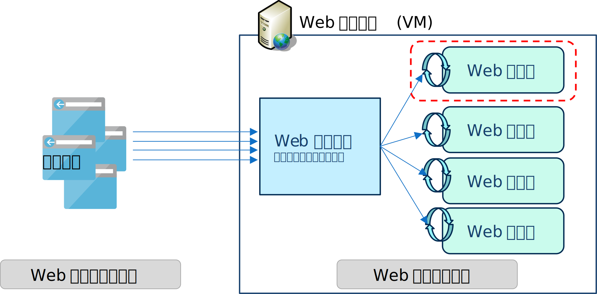
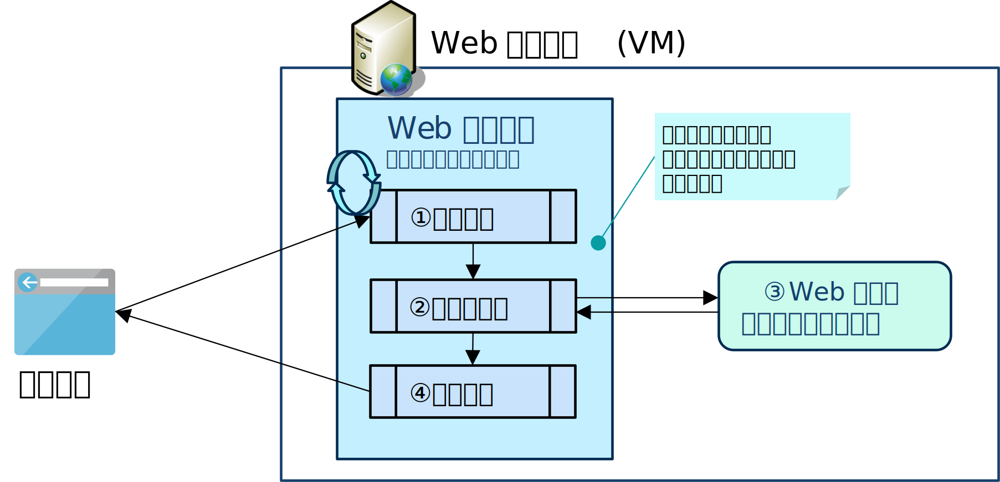
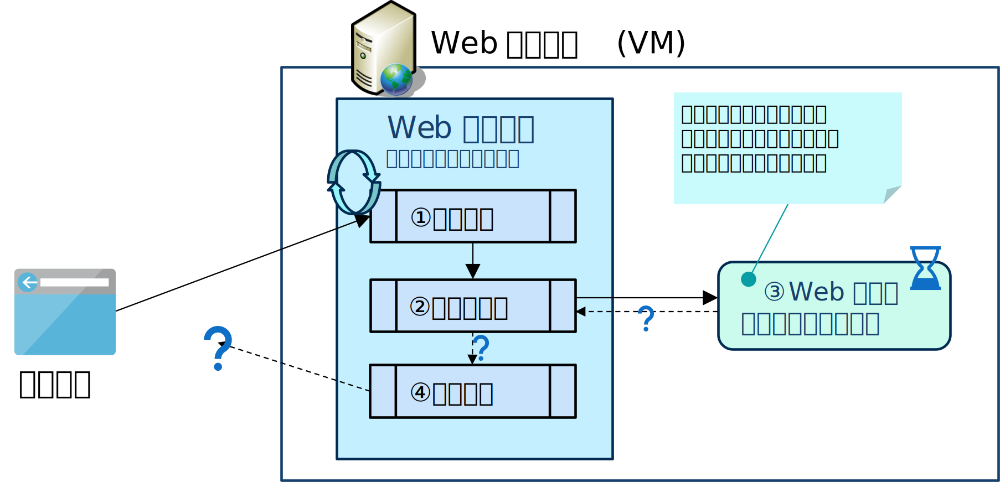

# Web アプリ編
マルチスレッドアプリケーションの設計に関する "あれこれ" を幾つかの記事に分けてシリーズで投稿しています。
本ページでは Web アプリをマルチスレッド化する時の考慮点について議論しています。



# Web アプリ(単体)におけるマルチスレッドの設計
Web システムは、ブラウウザ上で動作するアプリ(フロントエンド)と Web サーバー側で動作するアプリ(バックエンド)に分れます。
さらに、バックエンド側は、アプリロジックを実装する「Web アプリ」と、フロントエンドからの HTTP のリクエストを各 Web アプリに振り分ける「Web サーバー (HTTP サーバー)」(IIS,Apache,Nginx などに代表される)に分れます。

一般的な Web システムの開発者は、IIS, Apache, Nginx などに代表される Web サーバーを開発するわけではなく、その上に載るアプリを開発する事になると思います。
ここでは、IIS や Nginx 等の Web サーバー上で動作するアプリの事を、便宜的に「Web アプリ」と呼称して設計時の考慮点を説明したいと思います。

 

一般的に、Web アプリは一つ一つの処理は比較的単純なものの、複数のクライアントからのリクエストを同時並行で行う必要がある為、マルチスレッドで実装されます。
しかし、処理の並列化については Web サーバーが実装していますので、Web アプリ開発者自身がリクエストの並列化を実装する事はありません。

## アプリアーキテクチャ

次の図は、あるユーザーがブラウザを開いて最初の HTTP のページを表示したときの処理の流れを概略したものです。
先ほどの図では Web アプリの複数のインスタンスが同時並列に動作している様子を示しましたが、ここでは一つの Web アプリに着目して、処理の流れを図示しています。

 

 

図を見ながら順番に見ていきましょう。

① Web サーバーは、ブラウザからのページの表示要求(リクエスト)を受信します。

>受信処理は、複数のユーザーのリクエストを並列で捌く必要があるので、正確にはもっと複雑な構造をしています。しかし今は話を簡略化します。
>ここでは、一つのスレッドでブラウザからのリクエストを受信していると（仮に）見なしてください。

② Web アプリを呼び出して完了を待機します。なお、開発に利用しているフレームワークにもよりますが、Web アプリの呼出しの前後にはフレームワークの前処理や後処理が実行されます。

③ この Web アプリはユーザーが実装したビジネスロジックを含むコンポーネントの事です。通常、Web システムのバックエンド開発者は、このコンポーネントを実装する事になります。

④ 応答電文を返信します。

Web アプリは複数のインスタンスが同時並列に動作しますが、一つの一つの Web アプリの処理に着目すると、Web アプリのロジックは論理的なシングルスレッドで動作する点を理解しておいてください。

> 少し枝葉の話になってしまうのですが、ここで「論理的な」と注釈を加えているのは、一つの物理スレッドが最初から最後まで一つのリクエストを担当するとは限らないからです。
> Web サーバーの実装にも依存するのですが、途中で物理スレッドは切り替わる事があります。
> ただ、物理スレッドは切り替るものの同時には動かないので Web アプリからみたら論理的なシングルスレッドと見なして大丈夫です。

## マルチスレッド化の目的

さて、本記事では単体の Web アプリに着目して議論を進めます。同時並行で動作しているお隣りの Web アプリについては一旦無視します。

Web アプリのロジックはシングルスレッドで動作していますので、時間がかかる処理を実装するときは工夫が必要です。
下の図は③の処理に時間がかかっていると仮定しています。ユーザー（ブラウザ）側から見ると、サーバーからの応答が返ってこないので画面の更新ができません。
結果的に画面がフリーズしたようになり、ユーザービリティが悪くなってしまいます。

 

 

この問題の解決策も「対話型アプリ」の議論と同じく、時間のかかる処理をバックグラウンドスレッドで実行(非同期実行)させる方法です。しかし「対話型アプリ」のケースと違い、実際の画面がブラウザ側（ネットワークの向こう側）にある為、結果の受け取り方に工夫が必要になります。

