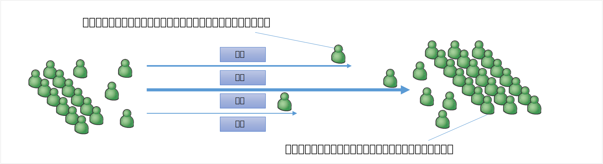
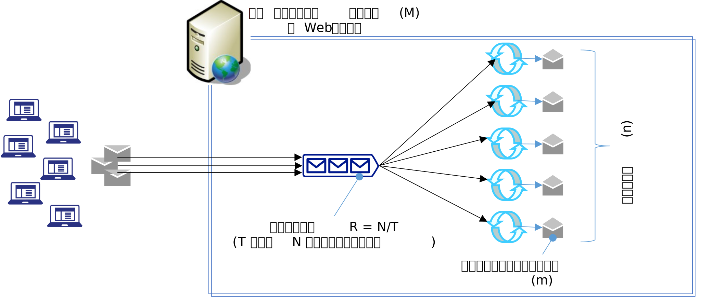

# パフォーマンスとは

システムパフォーマンスとは何かを考えます。ここでも人によって想像している
対象システムが異なっていると、微妙にイメージするものが違う事があるので、
この記事では「Web システムのパフォーマンス」を前提にして説明します。

パフォーマンスを測る指標(性能指標)には、応答時間、レイテンシ、スループッ
ト、キャパシティなど色々ありますが、システム的な観点では以下の 3 種類の
指標を計測します。

さらに、システム観点ではなく利用者目線(業務観点)で計測した「ワークロード」
(最大利用ユーザー数やデータ処理量など)を計測しますが、この記事では割愛し
ます。

<table>
<tr>
<th>性能指標</th>
<th>説明</th>
<th>同じ分類の指標</th>
</tr>
<tr>
<td>スループット</td>
<td>単位時間あたりの処理件数</td>
<td>RPS (Requests per Second), TPS (Transactions per Second)</td>
</tr>
<tr>
<td>レスポンスタイム</td>
<td>応答時間</td>
<td>応答時間、実行時間、レイテンシ、TTLB</td>
</tr>
<tr>
<td>リソース使用率</td>
<td>アプリケーションによるサーバーリソースの消費率</td>
<td>CPU 使用率、メモリ使用率など</td>
</tr>
</table>

# スループットとレスポンスタイム

さて、性能指標として上の三つを紹介しましたが、この内「リソース使用率」はスループットと比例関係にあります。つまり技術的にはリソース使用率はスループットと同じカテゴリと考えられます。
よって、この章ではスループットとレンポンスタイムを深堀する事にします。この両指標の意味と関係を理解することがパフォーマンスを理解する上で重要になります。

## スループットとレスポンスタイムの関係

スループットは、Web アプリの場合は「単位時間あたり何件のリクエストを処理できるか」という指標です。通常 RPS という指標で計測します。

レスポンスタイムは「ブラウザから送信したリクエストの応答が返ってくるまでの総時間」で、通常は TTLB という指標で計測します。

まずはスループットとレスポンスタイムの *関係* を理解する必要があります。そこで「駅の改札を通る人」の例えで説明します。

 

 

図にあるようにレスポンスタイムは改札を通過する人の通過スピードに対応し、スループットは単位時間に改札を通過した人の数に対応します。
この様にスループットとレスポンスタイムは、例えば、電圧と電流、位置エネルギーと運動エネルギーの関係のように、全く異なる指標であるという事です。

また、パフォーマンスを測定する場合は、最低限、この 2 つは測定する必要があります。片方だけでは性能を表せません。

## グラフの形状(理論値)

Web アプリに、同時実行スレッド数(ユーザー数)を徐々に増やしながら負荷を掛けた場合、スループットとレスポンスタイムのグラフがどうなるか考えてみます。

いま、下図のように Web サーバーがクライアントのリクエストを処理能力全開で捌いている状態をイメージします。
なお、ここでの説明は物理の教科書の様な厳密なモデル化を行なって議論している訳ではなくイメージを掴んで頂く為の概略ですので、大雑把な議論である事をご承知おきください。

 

 

### スループット

今 N 件のリクエストの総処理コストは〈 m*N 〉で表わす事ができます。また、サーバーの処理能力を (M) として時間 (T) の間に N 件のリクエストを全て処理できたとすると〈 m*N = M*T 〉が成立します。
スループットは単位時間あたりの処理件数ですから、件数 N を処理時間 T で除算すれば求まります。つまり、スループットは〈 R = N/T = M/m 〉となります。

この事から、スループットは、サーバーの処理能力 (M) に比例する事が分ります。つまりサーバーの性能が良ければ良いほど多くのリクエストを多く捌ける事を意味します。
ただし、サーバーの処理能力はハードウエア制約になるので上限があり、上限値を越えて向上させようと思ったらサーバーを増強するしかありませんので、処理能力 (M) は通常は定数と見做します。

また、スループットはリクエストの処理コスト (m) に反比例する事が分ります。つまり、一つのリクエスト処理が重ければ重い程、捌けるリクエスト数が少なくなります。
なお、リクエストの処理内容によって、当然、処理コスト (m) にはバラつきがありますが、負荷がかかっている状態で全てのリクエストの平均を (m) と考えれば、便宜的にこちらも定数とみなして良いでしょう。

つまり、サーバーが全力でリクエストを処理している瞬間は M と m は定数と考えられますから、スループットは一定値になる事がわかります。

### レスポンスタイム

レスポンスタイムは厳密にはクライアントからみた時の応答時間ですが、単純化する為、サーバー上での処理時間で概算します。
今、スレッド数 (n) のスレッドが同時並列で処理コスト (m) のリクエストを一斉に処理している状態で、これらの処理が完了するまでの時間 (t) は、〈 t = (n*m)/M 〉で表せます。ここでスループットが〈 R = M/m 〉ですから処理時間は〈 t = n/R 〉となります。

つまり、処理時間(≒レスポンスタイム)は、スレッド数に比例し、そのグラフの傾きはスループットの逆数〈 1/R 〉で表わす事ができます。

# 並列化によりパフォーマンスが阻害されるケース

つぎに、スレッドを増やすと(増やし過ぎてしまうと)、逆にパフォーマンスが落ちてしまうケースを考えます。
(なお、バッチアプリに限った話ではありません)

## リソース競合(排他処理)

例えば、同一のファイルを複数のスレッドから同時に書込みしようとすると、ファイルの中身がグチャグチャになる可能性があります。これを避ける為、通常は他のスレッドが書込みを行なっている最中は何かしらのロック機能を使用して排他制御を行う事になります。
その結果、複数のスレッドが同時に書き込み処理を行なう状況では、前のスレッドが書込みを完了するまで「待ち」が発生しますので、スレッドが増えれば増えるほど待ち時間の割合が嵩む事になり、結果的にパフォーマンスが下ります。

ファイルの例を挙げましたが、他にもデータベース読み書きやメモリの読み書きなど、シリアル(直列)にしか処理できないケースは多々あり、これらは同時実行数(=スレッド数)が増えれば増えるほどパフォーマンスに影響する為、なるべく競合が発生しない設計が必要になります。

## リソースボトルネック

通常 PC には CPU 時間、ディスクIO、物理メモリ、ネットワーク帯域などの様々なリソース(資源)から構成されています。そして、各リソースは有限です。
例えば、ディスクの書込み速度の上限が 100 byte/sec だと仮定します(←説明の為だけなので値は適当です)、ある一つのスレッドが 100 byte のデータを書き出す場合を想定した場合、データの書き出しには 1 秒かかる計算になります。
これが 10 スレッドになった場合には、単純計算 10 秒の時間がかかります。なお OS は各スレッドを均等にタイムスライスしますので、最後のスレッドだけが 10 秒ではなく、どのスレッドもほぼ 10 秒になります。

このように、ディスクやメモリなどのリソースが不足する場合(ボトルネックが発生している場合)は、同時実行数(=スレッド数)が増えれば増えるほどリソース消費量も増えるのでパフォーマンスに影響します。この為、なるべくリソースの使用量を抑える設計が必要になります。

なお、補足知識になりますが、リソースには上限を超えるとエラーになるものと、エラーにはならない代りにパフォーマンスが落ちるものがあることを理解しておくと良いと思います。
例えば、プロセスは一度に同時にオープンできるファイルの最大数は決まっており、これを超えるとエラーになります。一方で、CPU 時間や、ディスク IO、物理メモリなどは上限に逹したからと言ってエラーにはなりません。これらはエラーになる代りに、多くの場合はパフォーマンスに影響が出ます。

## コンテキストスイッチ

通常 OS は、それぞれのコア上で複数のスレッドを適宜切り替えながら並行処理で実行します。また、あるスレッドの実行は一つコアに固定(アフィニティ)しません。複数のコアを切り替えながら実行します。
この為、OS が複数のスレッドを並列・並行処理する場合、スレッドを切り替える際に、現在実行中のスレッドを一時的に停止⇒現在の状態をどこかに退避⇒別のスレッドの状態を復元⇒処理を再開といった処理を行なっています。
この切り替え処理の事を「コンテキストスイッチ」と呼称します。

当然ながらスレッド数が増えれば増える程、このコンテキストスイッチの回数が増えます。結果、スレッド数を増やし過ぎると、コンテキストスイッチの処理が無視できないくらい大きくなり、パフォーマンスが向上しないという現象が発生します。

